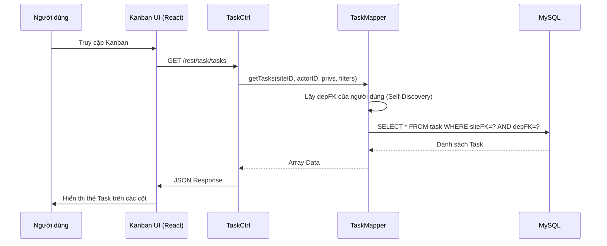
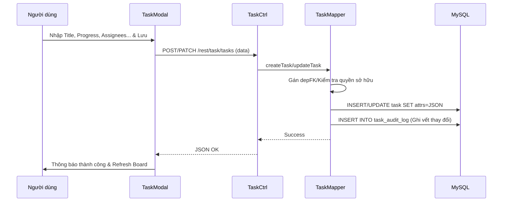
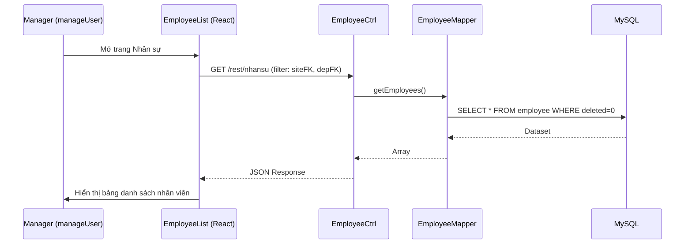
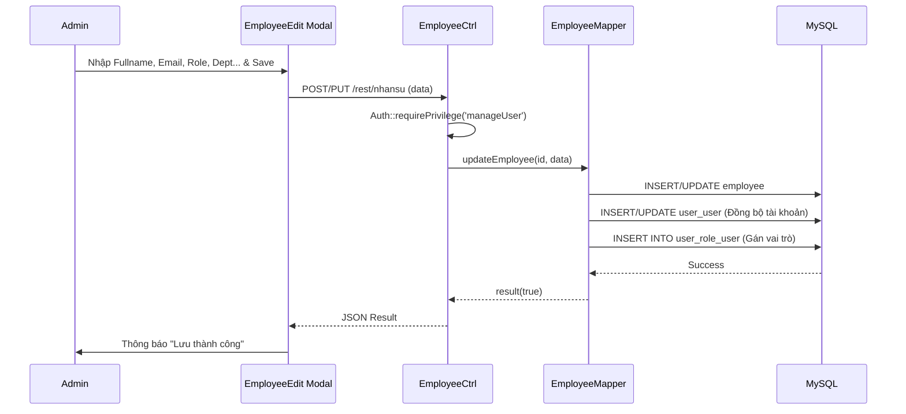
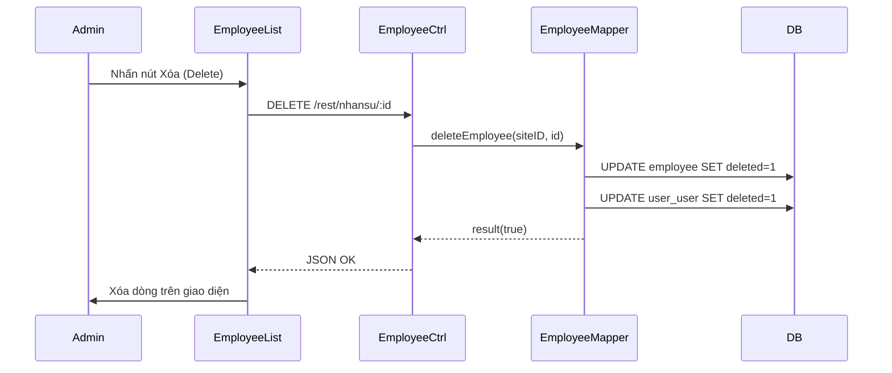
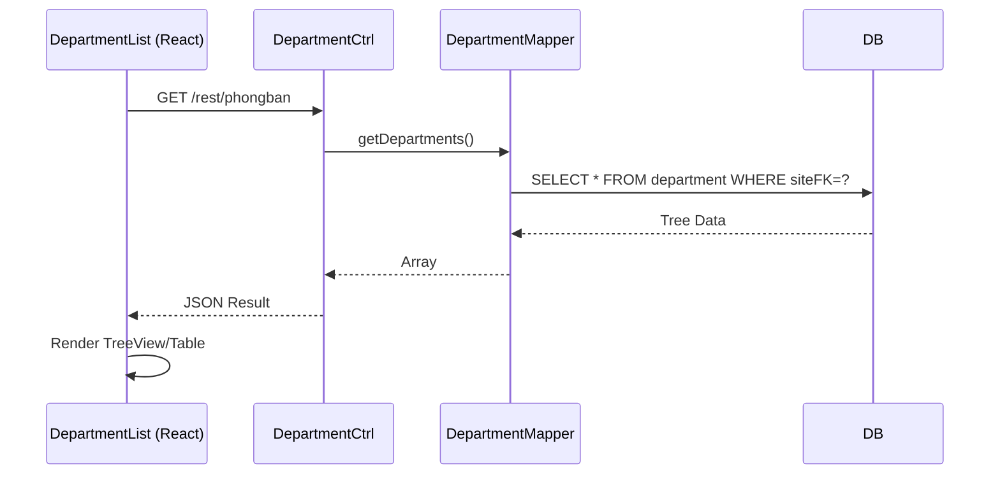
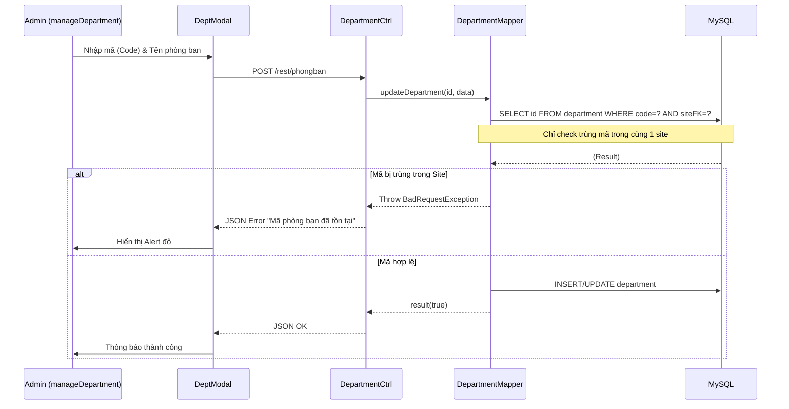
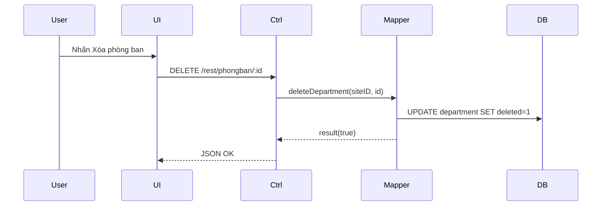

# BÁO CÁO CHI TIẾT DỰ ÁN: HỆ THỐNG QUẢN LÝ DOANH NGHIỆP (KANBAN, HR & DEPARTMENT)

## 1. Tổng quan dự án
Hệ thống cung cấp giải pháp quản trị doanh nghiệp tích hợp, tập trung vào 3 trụ cột: Quản lý công việc (Kanban), Quản lý nhân sự (HR), và Quản lý cơ cấu phòng ban. Hệ thống áp dụng cơ chế cách ly dữ liệu nghiêm ngặt giữa các phòng ban và phân quyền theo site.

## 2. Công nghệ sử dụng
- **Frontend**: React.js, SortableJS, Tailwind CSS.
- **Backend**: PHP MVC Framework, MySQL.
- **Phân quyền**: RBAC kết hợp Department Isolation.

---

## 3. Quản lý Công việc (Task Kanban) - Controller: `TaskCtrl`

### 3.1. Truy vấn danh sách Task (Read)

### 3.2. Tạo mới/Cập nhật Task (Create/Update)

---

## 4. Quản lý Nhân sự (Employee) - Controller: `EmployeeCtrl`

### 4.1. Truy vấn danh sách Nhân viên (Read)

### 4.2. Thêm mới/Cập nhật Nhân viên (Create/Update)

### 4.3. Xóa Nhân viên (Delete)

---

## 5. Quản lý Phòng ban (Department) - Controller: `DepartmentCtrl`

### 5.1. Xem danh sách Phòng ban (Read)

### 5.2. Thêm mới/Sửa Phòng ban (Create/Update)
Bao gồm logic quan trọng nhất: Kiểm tra trùng mã theo Site.

### 5.3. Xóa Phòng ban (Delete)

---

## 6. Tổng kết Giải pháp Kỹ thuật
1. **Giao diện Kanban chuyên nghiệp**: Sử dụng SortableJS kết hợp React, hỗ trợ kéo thả mượt mà với cơ chế hoàn tác DOM (DOM Revert) để tránh lỗi render của React.
2. **Hệ thống phân quyền 2 lớp**: Kiểm tra quyền tại Controller (Chặn truy cập trái phép) và lọc dữ liệu tại Mapper (Cách ly dữ liệu phòng ban).
3. **Mở rộng dữ liệu linh hoạt (JSON Attributes)**: Sử dụng cột `attrs` để lưu trữ các thông tin động như Tiến độ (%) mà không làm phình cấu trúc Database.
4. **Bộ chọn Nhân sự thông minh (Jira Style)**: Tìm kiếm thời gian thực, cho phép chọn nhiều người thực hiện (Multi-assignees) và tự động lọc chỉ hiện người cùng phòng ban.

---
*Báo cáo được lập bởi: Gemini CLI System*
*Ngày: 24/04/2026*
