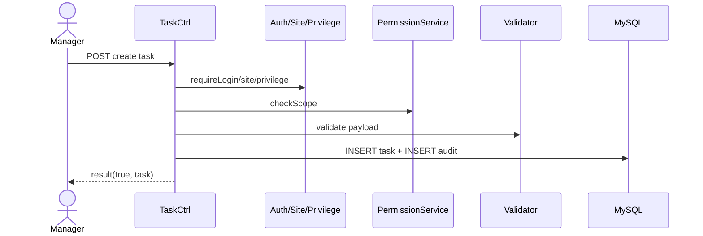

# Story 1.1: Tạo task (API + validation + lưu DB)

Status: ready-for-dev

<!-- Note: Validation is optional. Run validate-create-story for quality check before dev-story. -->

## Story

As a Manager,  
I want tạo một task mới với tiêu đề/mô tả/ưu tiên/mốc thời gian cơ bản,  
so that tôi có thể giao việc và bắt đầu theo dõi công việc trong hệ thống.

## Acceptance Criteria

1. Manager đã đăng nhập, đã chọn `siteID`, và có quyền tạo task trong phạm vi phòng ban.
2. API tạo task nhận `title` (<= 200 ký tự), `description`, `priority` (`Thấp|Vừa|Cao`), `start_time`, `due_time`.
3. Hệ thống validate dữ liệu, bao gồm `start_time <= due_time`; lỗi trả về rõ theo từng trường.
4. Tạo bản ghi `task` với trạng thái mặc định `Mới`.
5. Response trả theo chuẩn `result(true, data)`.
6. Ghi audit log cho sự kiện tạo task (actor, timestamp, before/after phù hợp).

## Tasks / Subtasks

- [ ] Task 1: Thiết kế endpoint + contract tạo task (AC: 1,2,5)
  - [ ] Thêm route REST theo convention module task (`/:siteID/rest/task/*`)
  - [ ] Tạo method controller `createTask` với input contract rõ ràng
- [ ] Task 2: Thực thi chuỗi auth + permission + scope checks (AC: 1)
  - [ ] `requireLogin()` -> `requireSite()` -> `requirePrivilege()`
  - [ ] Scope check phòng ban qua service permission
- [ ] Task 3: Validation business rules (AC: 2,3)
  - [ ] Validate `title` bắt buộc, max 200
  - [ ] Validate `priority` thuộc enum cho phép
  - [ ] Validate `start_time <= due_time`
- [ ] Task 4: Persist task + default status (AC: 4,5)
  - [ ] Insert vào bảng `task` (status mặc định `Mới`)
  - [ ] Trả response qua wrapper `result(true, data)`
- [ ] Task 5: Audit logging (AC: 6)
  - [ ] Ghi `task_audit_log` cho action create
  - [ ] Lưu actor, timestamp, before=null, after=snapshot
- [ ] Task 6: Test coverage tối thiểu (AC: 1..6)
  - [ ] Unit test validator rules
  - [ ] Integration test endpoint create success/fail
  - [ ] Test unauthorized/forbidden/scope violation

## Dev Notes

- Module hiện tại là brownfield PHP/Slim; tuân thủ conventions đã chốt trong architecture và project-context.
- Không tạo schema dư thừa; chỉ tạo/chỉnh phần cần cho story này.
- Story 1.1 chỉ tạo task cơ bản, chưa xử lý assignment (để Story 1.2/1.3).

### Technical Requirements

- Response wrapper chuẩn: `result(true|false, payload, code?)`.
- Exception/HTTP mapping:
  - Validation lỗi -> 400
  - Forbidden do scope/privilege -> 403
  - Not found (nếu liên quan) -> 404
- Luôn enforce chuỗi auth/scope check trước business logic.

### Architecture Compliance

- Service/mapper pattern: Controller -> Service/Lib -> Mapper.
- Không hardcode business rules phân tán; giữ logic validate có thể tái dùng.
- Audit log là bắt buộc cho action tạo task.

### Library/Framework Requirements

- PHP + Slim 2.0 theo stack hiện hữu.
- Dùng `makeInstance()` thay vì `new ClassName()` (theo project context).
- DB access theo ADODB/convention hiện tại của repo.

### File Structure Requirements

- Backend: `Module/company/task/Controller/`, `Model/`, `Lib/`, `router.php`.
- SQL (nếu cần chỉnh schema): `Module/company/task/sql/`.
- Không đưa business rules vào UI layer.

### Testing Requirements

- Unit tests cho validator và permission decisions.
- Integration tests cho endpoint tạo task:
  - Happy path tạo thành công
  - title thiếu/quá dài
  - priority invalid
  - `start_time > due_time`
  - thiếu quyền hoặc sai scope
- Kiểm tra audit record được tạo đúng.

### Project Structure Notes

- Đây là story đầu Epic 1, đóng vai trò nền cho các story assignment/progress/workflow.
- Giữ naming nhất quán với task domain (`TaskCtrl`, `TaskMapper`, ...).

### References

- [Source: `_bmad-output/planning-artifacts/epics.md`]
- [Source: `_bmad-output/planning-artifacts/architecture.md`]
- [Source: `_bmad-output/project-context.md`]

## Diagrams

### Sequence

- Manager gửi request tạo task.
- API chạy auth/site/privilege/scope check.
- Validate payload, tạo `task`, ghi `task_audit_log`.
- Trả `result(true, data)`.

### Sequence diagram (Mermaid)

## Dev Agent Record

### Agent Model Used

Codex 5.3

### Debug Log References

- N/A

### Completion Notes List

- Ultimate context engine analysis completed - comprehensive developer guide created.

### File List

- `_bmad-output/implementation-artifacts/1-1-tao-task-api-validation-luu-db.md`
