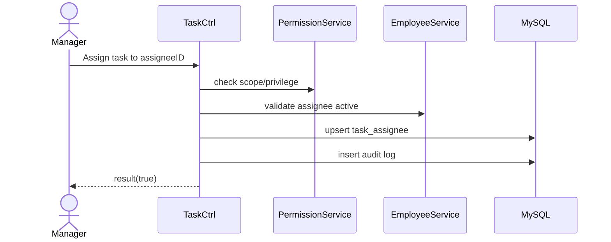

# Story 1.2: Giao task cho cá nhân (assignee đơn)

Status: ready-for-dev

## Story

As a Manager, I want giao task cho một nhân viên cụ thể, so that có người chịu trách nhiệm rõ ràng.

## Acceptance Criteria

1. Chỉ Manager có quyền trong scope mới được gán cá nhân.
2. Từ chối assignee `Đã nghỉ việc` hoặc ngoài phạm vi.
3. Lưu quan hệ gán vào `task_assignee`.
4. Ghi audit “đổi người nhận”.

## Tasks / Subtasks

- [ ] Tạo endpoint assign individual.
- [ ] Check auth/site/privilege/scope.
- [ ] Validate assignee active.
- [ ] Persist assignment + audit.
- [ ] Viết test success/fail.

## Dev Notes

- Tuân thủ `result()` response wrapper.
- Không bypass permission chain.

## Diagrams

### Sequence

- Manager chọn task + assignee.
- API check quyền/scope.
- Validate trạng thái nhân sự.
- Lưu `task_assignee` + audit.

### Sequence diagram (Mermaid)

## Dev Agent Record

### Agent Model Used
Codex 5.3

### Debug Log References
- N/A

### Completion Notes List
- Context copied from planning story and normalized to implementation artifact.

### File List
- `_bmad-output/implementation-artifacts/1-2-giao-task-cho-ca-nhan-assignee-don.md`
