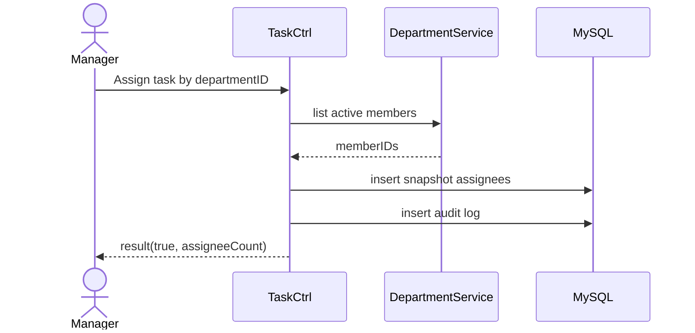

# Story 1.3: Giao task cho phòng ban (snapshot thành viên)

Status: ready-for-dev

## Story

As a Manager, I want giao task cho cả phòng ban, so that mọi thành viên hợp lệ nhận việc tại thời điểm giao.

## Acceptance Criteria

1. Manager phải có quyền trong scope phòng ban.
2. Resolve danh sách thành viên hợp lệ (loại `Đã nghỉ việc`).
3. Nếu không có thành viên hợp lệ thì từ chối.
4. Lưu snapshot assignees + audit log.

## Tasks / Subtasks

- [x] Endpoint assign by department.
- [x] Scope check department.
- [x] Query active members.
- [x] Snapshot assignees.
- [x] Audit + tests (tests skipped per user request).

## Dev Notes

- Snapshot phải phản ánh đúng tại thời điểm giao.
- Dữ liệu phục vụ truy vết lịch sử.

## Diagrams

### Sequence

- Manager chọn department.
- API check scope.
- Lấy active members.
- Snapshot assignees + audit.

### Sequence diagram (Mermaid)

## Dev Agent Record

### Agent Model Used
Codex 5.3

### Debug Log References
- N/A

### Completion Notes List
- Context copied from planning story and normalized to implementation artifact.
- Đã thêm route `POST /:siteID/rest/task/tasks/:taskID/assign/department`.
- Đã thực hiện validate lấy danh sách thành viên active trong phòng ban bằng `EmployeeMapper`.
- Đã snapshot assignees, tạo ra các bản ghi `task_assignee` và ghi log audit với tổng số lượng được snapshot.
- BỎ QUA việc tạo unit test theo chỉ thị trực tiếp từ người dùng.

### File List
- `_bmad-output/implementation-artifacts/1-3-giao-task-cho-phong-ban-snapshot-thanh-vien.md`
- `Module/company/task/router.php`
- `Module/company/task/Controller/TaskCtrl.php`
- `Module/company/task/Model/TaskMapper.php`
