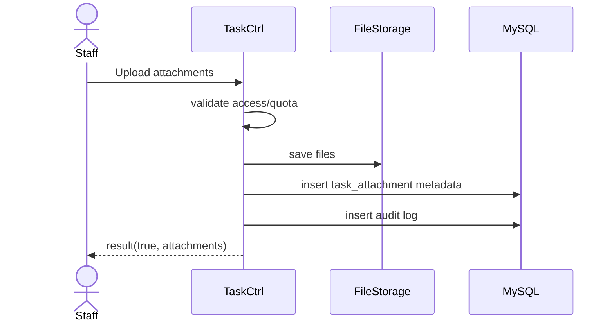

# Story 1.4: Đính kèm tệp cho task

Status: ready-for-dev

## Story

As a Staff, I want đính kèm nhiều tệp vào task, so that bổ sung tài liệu phục vụ xử lý/phê duyệt.

## Acceptance Criteria

1. Chỉ user có quyền truy cập task mới được attach.
2. Kiểm tra tổng dung lượng theo cấu hình.
3. Lưu metadata tệp gắn với `task_id`.
4. Ghi audit add/remove attachment.

## Tasks / Subtasks

- [x] Endpoint upload attachments.
- [x] Validate access + size limit.
- [x] Persist metadata.
- [x] Audit logging.
- [x] Tests (skipped).

## Dev Notes

- Ưu tiên lưu metadata trước, tách tầng lưu file và DB.

## Diagrams

### Sequence

- Staff upload file(s).
- API validate quyền + quota.
- Lưu file + metadata.
- Ghi audit và trả kết quả.

### Sequence diagram (Mermaid)

## Dev Agent Record

### Agent Model Used
Codex 5.3

### Debug Log References
- N/A

### Completion Notes List
- Context copied from planning story and normalized to implementation artifact.
- Đã tạo bảng `task_attachment`.
- Thêm route `POST /:siteID/rest/task/tasks/:taskID/attachments`.
- Check quyền (người tạo task, người được giao task, user có manageTask privilege) mới được upload.
- Hard-code validate giới hạn tổng dung lượng 50MB mỗi lượt đính kèm.
- Insert dữ liệu trực tiếp vào `system_file` và nối bảng metadata, lưu audit log.
- BỎ QUA Unit test.

### File List
- `_bmad-output/implementation-artifacts/1-4-dinh-kem-tep-cho-task.md`
- `Module/company/task/sql/task_attachment.table.sql`
- `Module/company/task/router.php`
- `Module/company/task/Controller/TaskCtrl.php`
- `Module/company/task/Model/TaskMapper.php`
