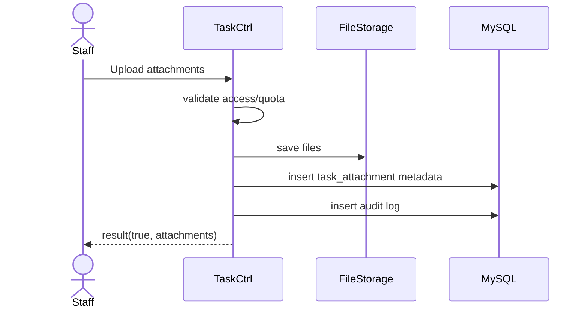

# Story 1.4: Đính kèm tệp cho task

Status: ready-for-dev

## Story

As a Staff, I want đính kèm nhiều tệp vào task, so that bổ sung tài liệu phục vụ xử lý/phê duyệt.

## Acceptance Criteria

1. Chỉ user có quyền truy cập task mới được attach.
2. Kiểm tra tổng dung lượng theo cấu hình.
3. Lưu metadata tệp gắn với `task_id`.
4. Ghi audit add/remove attachment.

## Tasks / Subtasks

- [ ] Endpoint upload attachments.
- [ ] Validate access + size limit.
- [ ] Persist metadata.
- [ ] Audit logging.
- [ ] Tests.

## Dev Notes

- Ưu tiên lưu metadata trước, tách tầng lưu file và DB.

## Diagrams

### Sequence

- Staff upload file(s).
- API validate quyền + quota.
- Lưu file + metadata.
- Ghi audit và trả kết quả.

### Sequence diagram (Mermaid)

## Dev Agent Record

### Agent Model Used
Codex 5.3

### Debug Log References
- N/A

### Completion Notes List
- Context copied from planning story and normalized to implementation artifact.

### File List
- `_bmad-output/implementation-artifacts/1-4-dinh-kem-tep-cho-task.md`
