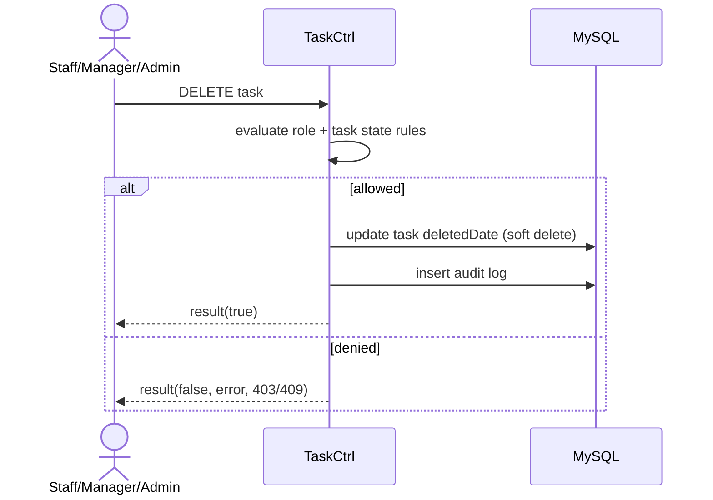

# Story 1.5: Ràng buộc thao tác xóa task (soft delete/lock theo quyền)

Status: ready-for-dev

## Story

As an Admin, I want kiểm soát việc xóa task theo quyền/trạng thái, so that không mất dữ liệu nghiệp vụ sai quy định.

## Acceptance Criteria

1. Staff không được xóa task đã giao.
2. Manager không xóa cứng task đã phát sinh xử lý.
3. Admin chỉ xóa theo policy (ưu tiên soft delete).
4. Bắt buộc audit before/after + reason (nếu có).

## Tasks / Subtasks

- [x] Endpoint delete/soft-delete.
- [x] Rule matrix theo role + state.
- [x] Persist soft delete/lock.
- [x] Audit logging.
- [x] Tests unauthorized/conflict (skipped).

## Dev Notes

- Ưu tiên deny-by-default cho delete.

## Diagrams

### Sequence

- User gọi delete.
- API check role/scope/rule.
- Nếu hợp lệ thì soft delete + audit.
- Nếu không hợp lệ trả lỗi quyền/conflict.

### Sequence diagram (Mermaid)

## Dev Agent Record

### Agent Model Used
Codex 5.3

### Debug Log References
- N/A

### Completion Notes List
- Context copied from planning story and normalized to implementation artifact.
- Thêm route `DELETE /:siteID/rest/task/tasks/:taskID`.
- Triển khai logic Rule Matrix:
  - Staff (không có manageTask privilege) chỉ được xóa mềm khi do chính họ tạo VÀ trạng thái là 'Mới'.
  - Báo lỗi 403 (Forbidden) hoặc 409 (Conflict) tương ứng.
  - Manager (có manageTask privilege) có thể xóa mềm bất kỳ task nào.
- Luôn sử dụng xóa mềm (`deleted = 1`) và lưu lý do vào audit log.
- BỎ QUA Unit test theo định hướng.

### File List
- `_bmad-output/implementation-artifacts/1-5-rang-buoc-thao-tac-xoa-task-soft-delete-lock-theo-quyen.md`
- `Module/company/task/router.php`
- `Module/company/task/Controller/TaskCtrl.php`
- `Module/company/task/Model/TaskMapper.php`
