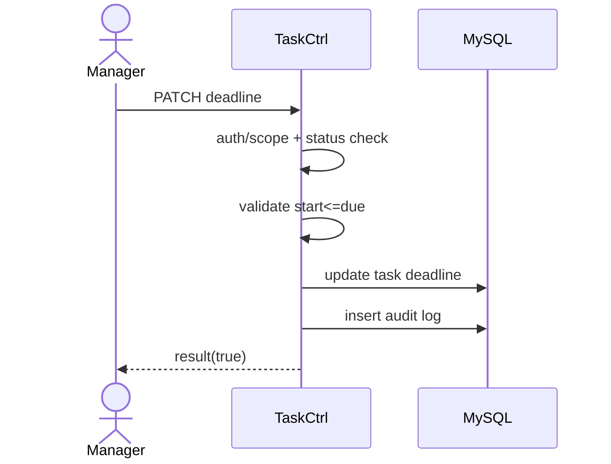

# Story 2.1: Cập nhật deadline task và hiển thị trạng thái sắp quá hạn/quá hạn

Status: ready-for-dev

## Story

As a Manager, I want cập nhật deadline trước khi task hoàn thành, so that điều chỉnh kế hoạch hợp lệ.

## Acceptance Criteria

1. Chỉ task chưa `Hoàn thành` mới được đổi deadline.
2. Validate `start_time <= due_time`.
3. Ghi audit before/after khi đổi deadline.
4. Dữ liệu trả về phản ánh dueSoon/overdue đúng mốc cấu hình.

## Tasks / Subtasks

- [ ] Endpoint patch deadline.
- [ ] Rule check status + validate thời gian.
- [ ] Persist + audit.
- [ ] Tests.

## Dev Notes

- Không cho sửa nội dung ngoài phạm vi story này.

## Diagrams

### Sequence

- Manager gửi patch deadline.
- API check quyền + status.
- Validate thời gian, update task, ghi audit.

### Sequence diagram (Mermaid)

## Dev Agent Record
### Agent Model Used
Codex 5.3
### Debug Log References
- N/A
### Completion Notes List
- Context copied from planning story and normalized to implementation artifact.
### File List
- `_bmad-output/implementation-artifacts/2-1-cap-nhat-deadline-task-va-hien-thi-trang-thai-sap-qua-han-qua-han.md`
