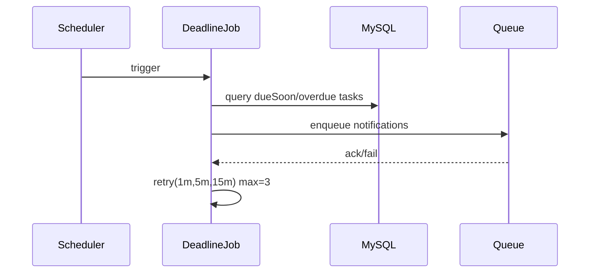

# Story 2.2: Job thông báo sắp quá hạn và quá hạn (async + retry)

Status: ready-for-dev

## Story

As a System, I want tự động gửi notify dueSoon/overdue, so that giảm task trễ hạn.

## Acceptance Criteria

1. Job scan deadline theo lịch.
2. Enqueue notification cho dueSoon/overdue.
3. Retry 1m -> 5m -> 15m, tối đa 3 lần.
4. Có log/metrics success-rate.

## Tasks / Subtasks

- [ ] Implement scan job.
- [ ] Build enqueue payload.
- [ ] Retry policy + tracking.
- [ ] Metrics/logging + tests.

## Dev Notes

- Tách scan logic và notify sender để dễ test.

## Diagrams

### Sequence

- Scheduler trigger job.
- Job query tasks dueSoon/overdue.
- Enqueue notify, retry theo policy nếu lỗi.

### Sequence diagram (Mermaid)

## Dev Agent Record
### Agent Model Used
Codex 5.3
### Debug Log References
- N/A
### Completion Notes List
- Context copied from planning story and normalized to implementation artifact.
### File List
- `_bmad-output/implementation-artifacts/2-2-job-thong-bao-sap-qua-han-va-qua-han-async-retry.md`
