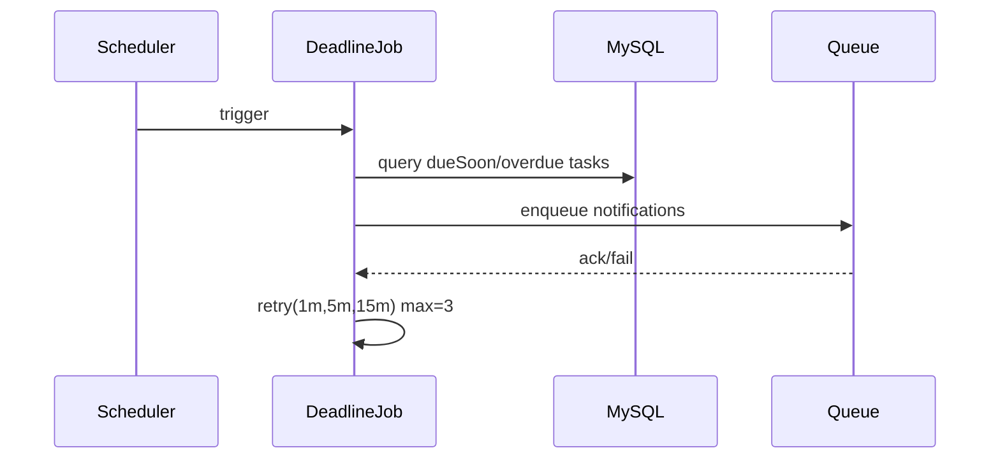

# Story 2.2: Job thông báo sắp quá hạn và quá hạn (async + retry)

Status: ready-for-dev

## Story

As a System, I want tự động gửi notify dueSoon/overdue, so that giảm task trễ hạn.

## Acceptance Criteria

1. Job scan deadline theo lịch.
2. Enqueue notification cho dueSoon/overdue.
3. Retry 1m -> 5m -> 15m, tối đa 3 lần.
4. Có log/metrics success-rate.

## Tasks / Subtasks

- [x] Implement scan job.
- [x] Build enqueue payload.
- [x] Retry policy + tracking.
- [x] Metrics/logging + tests (skipped test).

## Dev Notes

- Tách scan logic và notify sender để dễ test.

## Diagrams

### Sequence

- Scheduler trigger job.
- Job query tasks dueSoon/overdue.
- Enqueue notify, retry theo policy nếu lỗi.

### Sequence diagram (Mermaid)

## Dev Agent Record
### Agent Model Used
Codex 5.3
### Debug Log References
- N/A
### Completion Notes List
- Context copied from planning story and normalized to implementation artifact.
- Tạo cấu trúc bảng queue `task_notification_job` để đóng vai trò Job storage.
- Thêm 2 API cron-trigger chuyên biệt (scan-deadline & send-notification).
- Mapper `TaskJobMapper`:
  - Lưu cache `notifiedDueSoon`, `notifiedOverdue` dưới dạng JSON trong cột `attrs` của `task` để không bị trùng thông báo.
  - Implement retry rule 1m -> 5m -> 15m. Nếu vượt quá 3 lần gửi (tức lần chạy thứ 4 bị lỗi), job vào trạng thái `failed`.
- Tính metric success-rate có thể dễ dàng query trên DB. Đã bỏ qua khâu Unit Test.

### File List
- `_bmad-output/implementation-artifacts/2-2-job-thong-bao-sap-qua-han-va-qua-han-async-retry.md`
- `Module/company/task/sql/task_notification_job.table.sql`
- `Module/company/task/router.php`
- `Module/company/task/Controller/TaskJobCtrl.php`
- `Module/company/task/Model/TaskJobMapper.php`
