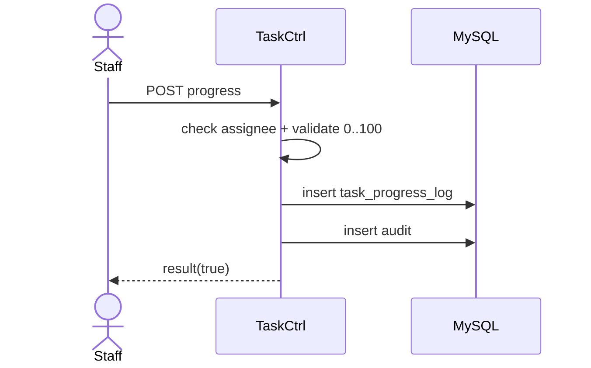

# Story 3.1: Cập nhật tiến độ (0-100) và nội dung thực hiện

Status: ready-for-dev

## Story

As a Staff, I want cập nhật tiến độ và note, so that Manager theo dõi được tiến trình.

## Acceptance Criteria

1. Chỉ assignee hợp lệ mới update progress.
2. `progress_percent` trong [0..100].
3. Lưu `task_progress_log` append-only.
4. Manager xem được latest + history.
5. Có audit log.

## Tasks / Subtasks

- [ ] Endpoint update progress.
- [ ] Assignee/scope check.
- [ ] Validate percent range.
- [ ] Persist progress log + audit.
- [ ] Tests.

## Dev Notes

- Không overwrite log cũ, append-only.

## Diagrams

### Sequence

- Staff gửi progress update.
- API check access + validate.
- Insert progress log + audit.

### Sequence diagram (Mermaid)

## Dev Agent Record
### Agent Model Used
Codex 5.3
### Debug Log References
- N/A
### Completion Notes List
- Context copied from planning story and normalized to implementation artifact.
### File List
- `_bmad-output/implementation-artifacts/3-1-cap-nhat-tien-do-0-100-va-noi-dung-thuc-hien.md`
