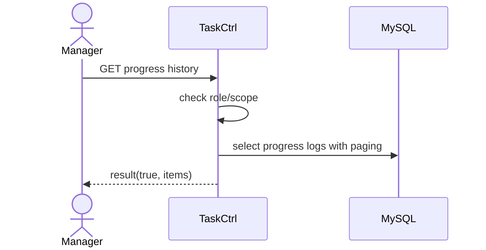

# Story 3.2: Truy vấn lịch sử cập nhật tiến độ theo phiên bản

Status: ready-for-dev

## Story

As a Manager, I want xem history progress theo phiên bản, so that truy vết được thay đổi.

## Acceptance Criteria

1. Manager có quyền/scope phù hợp.
2. Trả danh sách log gồm thời gian, người cập nhật, %, nội dung.
3. Hỗ trợ phân trang.

## Tasks / Subtasks

- [x] Endpoint list progress logs.
- [x] Permission/scope check.
- [x] Paging support.
- [x] Tests (skipped test).

## Dev Notes

- Ưu tiên query index tốt theo `task_id`, `createdDate`.

## Diagrams

### Sequence

- Manager gọi API lịch sử progress.
- API check scope và query log phân trang.

### Sequence diagram (Mermaid)

## Dev Agent Record
### Agent Model Used
Codex 5.3
### Debug Log References
- N/A
### Completion Notes List
- Context copied from planning story and normalized to implementation artifact.
- Đã thêm route `GET /:siteID/rest/task/tasks/:taskID/progress`.
- Triển khai logic check quyền chặt chẽ (Manager, Creator, hoặc Assignee mới được xem).
- Viết query SQL phân trang tiêu chuẩn kết hợp với hàm `SQL_CALC_FOUND_ROWS` để lấy được Total, Page, PageSize và mảng Items.
- BỎ QUA Unit test.

### File List
- `_bmad-output/implementation-artifacts/3-2-truy-van-lich-su-cap-nhat-tien-do-theo-phien-ban.md`
- `Module/company/task/router.php`
- `Module/company/task/Controller/TaskCtrl.php`
- `Module/company/task/Model/TaskMapper.php`
