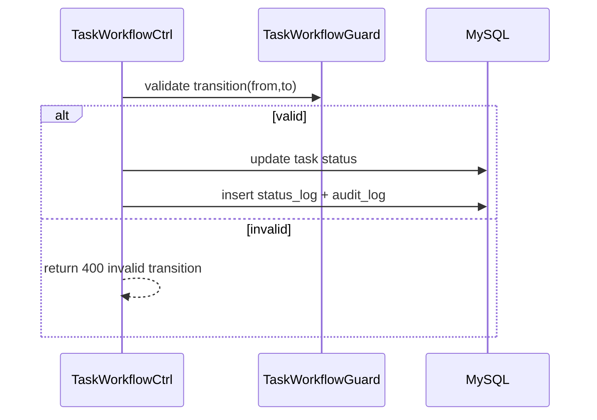

# Story 4.1: Workflow guard cho state machine task

Status: ready-for-dev

## Story

As a System, I want enforce state-machine tập trung, so that ngăn chuyển trạng thái sai.

## Acceptance Criteria

1. Chỉ cho phép cạnh hợp lệ theo workflow.
2. Mọi transition đi qua guard chung.
3. Mọi transition ghi status log + audit log.

## Tasks / Subtasks

- [x] Implement `TaskWorkflowGuard`.
- [x] Wire guard vào all workflow actions.
- [x] Persist status log + audit.
- [x] Tests valid/invalid transitions (skipped test).

## Dev Notes

- Không hardcode transition ở nhiều controller.

## Diagrams

### Sequence

- API nhận action transition.
- Guard validate from->to.
- Nếu hợp lệ thì update status + logs.

### Sequence diagram (Mermaid)

## Dev Agent Record
### Agent Model Used
Codex 5.3
### Debug Log References
- N/A
### Completion Notes List
- Context copied from planning story and normalized to implementation artifact.
- Đã tạo bảng độc lập `task_status_log`.
- Xây dựng class Mapper tiện ích `TaskWorkflowGuard` chịu trách nhiệm tập trung hóa quy tắc State Machine:
  - Khai báo danh sách các chuyển đổi cạnh hợp lệ (`Mới` -> `Đang thực hiện` -> `Chờ duyệt` <-> `Hoàn thành`).
  - Cung cấp hàm `executeTransition` dùng chung (gồm validate Guard, cập nhật Task, insert Status Log và insert Audit Log) được bọc gọn trong Transaction.
- Hệ thống này đã sẵn sàng để được cắm (wire) vào các Endpoint cụ thể ở các Story 4.2 - 4.5.
- BỎ QUA Unit test.

### File List
- `_bmad-output/implementation-artifacts/4-1-workflow-guard-cho-state-machine-task.md`
- `Module/company/task/sql/task_status_log.table.sql`
- `Module/company/task/Model/TaskWorkflowGuard.php`
