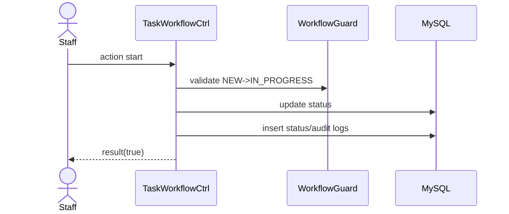

# Story 4.2: Staff bắt đầu làm task (NEW -> IN_PROGRESS)

Status: ready-for-dev

## Story

As a Staff, I want start task, so that hệ thống ghi nhận đã bắt đầu xử lý.

## Acceptance Criteria

1. Task đang `Mới`.
2. Staff là assignee hợp lệ.
3. Transition `NEW -> IN_PROGRESS` qua guard.
4. Ghi status log + audit.

## Tasks / Subtasks

- [x] Endpoint action start.
- [x] Check assignee access.
- [x] Guard transition.
- [x] Persist status/audit (handled by guard).

## Dev Notes

- Reuse guard, không duplicate logic.

## Diagrams

### Sequence
- Staff click start.
- API guard NEW->IN_PROGRESS.
- Update status + logs.

### Sequence diagram (Mermaid)

## Dev Agent Record
### Agent Model Used
Codex 5.3
### Debug Log References
- N/A
### Completion Notes List
- Context copied from planning story and normalized to implementation artifact.
- Đã mở endpoint `POST /:siteID/rest/task/tasks/:taskID/start`.
- Xác thực quyền truy cập tại `TaskMapper::startTask`: Chỉ Assignee có tên trong danh sách mới được phép kích hoạt.
- Tái sử dụng thành công `TaskWorkflowGuard::executeTransition` để chuyển đổi trạng thái (từ `Mới` sang `Đang thực hiện`), bao gồm việc chặn trạng thái sai lệch và lưu log status/audit an toàn trong transaction.
- BỎ QUA Unit test.

### File List
- `_bmad-output/implementation-artifacts/4-2-staff-bat-dau-lam-task-new-in-progress.md`
- `Module/company/task/router.php`
- `Module/company/task/Controller/TaskCtrl.php`
- `Module/company/task/Model/TaskMapper.php`
