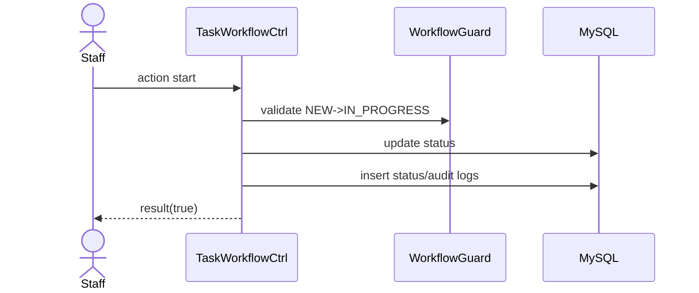

# Story 4.2: Staff bắt đầu làm task (NEW -> IN_PROGRESS)

Status: ready-for-dev

## Story

As a Staff, I want start task, so that hệ thống ghi nhận đã bắt đầu xử lý.

## Acceptance Criteria

1. Task đang `Mới`.
2. Staff là assignee hợp lệ.
3. Transition `NEW -> IN_PROGRESS` qua guard.
4. Ghi status log + audit.

## Tasks / Subtasks

- [ ] Endpoint action start.
- [ ] Check assignee access.
- [ ] Guard transition.
- [ ] Persist status/audit.

## Dev Notes

- Reuse guard, không duplicate logic.

## Diagrams

### Sequence
- Staff click start.
- API guard NEW->IN_PROGRESS.
- Update status + logs.

### Sequence diagram (Mermaid)

## Dev Agent Record
### Agent Model Used
Codex 5.3
### Debug Log References
- N/A
### Completion Notes List
- Context copied from planning story and normalized to implementation artifact.
### File List
- `_bmad-output/implementation-artifacts/4-2-staff-bat-dau-lam-task-new-in-progress.md`
