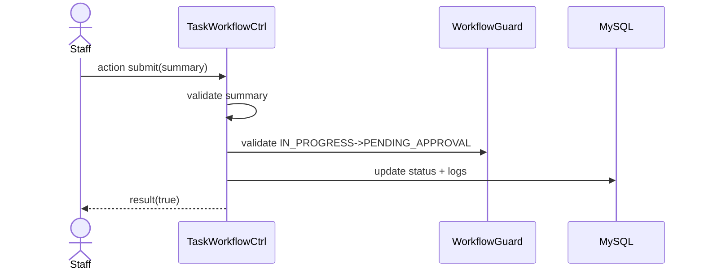

# Story 4.3: Staff gửi duyệt kết quả (IN_PROGRESS -> PENDING_APPROVAL)

Status: ready-for-dev

## Story

As a Staff, I want submit kết quả, so that Manager có thể duyệt.

## Acceptance Criteria

1. Task đang `Đang làm`.
2. Bắt buộc có summary tối thiểu.
3. Transition `IN_PROGRESS -> PENDING_APPROVAL` qua guard.
4. Ghi status log + audit.

## Tasks / Subtasks

- [x] Endpoint submit.
- [x] Validate summary.
- [x] Guard transition.
- [x] Persist logs.

## Dev Notes

- Lỗi thiếu summary trả 400 rõ ràng.

## Diagrams

### Sequence
- Staff submit + summary.
- API validate summary.
- Guard transition, update status/logs.

### Sequence diagram (Mermaid)

## Dev Agent Record
### Agent Model Used
Codex 5.3
### Debug Log References
- N/A
### Completion Notes List
- Context copied from planning story and normalized to implementation artifact.
- Xây dựng endpoint `POST /:siteID/rest/task/tasks/:taskID/submit`.
- API đã thiết lập bắt buộc kiểm tra `note` (nếu để trống thì ném `BadRequestException` 400).
- Quyền lợi Assignee được check sát sao (không phải Assignee thì không được nộp bài).
- Transition thành công thông qua `TaskWorkflowGuard` (từ `Đang thực hiện` sang `Chờ duyệt`), đồng thời lưu vết đầy đủ.
- BỎ QUA Unit test.

### File List
- `_bmad-output/implementation-artifacts/4-3-staff-gui-duyet-ket-qua-in-progress-pending-approval.md`
- `Module/company/task/router.php`
- `Module/company/task/Controller/TaskCtrl.php`
- `Module/company/task/Model/TaskMapper.php`
