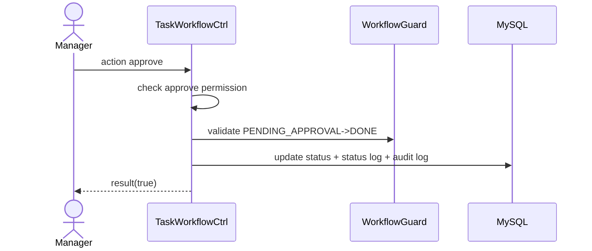

# Story 4.4: Manager phê duyệt task (PENDING_APPROVAL -> DONE)

Status: ready-for-dev

## Story

As a Manager, I want approve task chờ duyệt, so that kết thúc công việc đúng quy trình.

## Acceptance Criteria

1. Task ở trạng thái `Chờ duyệt`.
2. Manager có quyền duyệt trong scope.
3. Transition `PENDING_APPROVAL -> DONE` qua guard.
4. Ghi status log + audit.
5. Sau DONE không sửa nội dung chính.

## Tasks / Subtasks

- [ ] Endpoint approve.
- [ ] Permission check manager approve.
- [ ] Guard transition + persist.
- [ ] Enforce lock-content-after-done rule.

## Dev Notes

- Rule khóa nội dung chính sau DONE là bắt buộc.

## Diagrams

### Sequence
- Manager approve.
- API check permission + guard.
- Update status DONE + logs.

### Sequence diagram (Mermaid)

## Dev Agent Record
### Agent Model Used
Codex 5.3
### Debug Log References
- N/A
### Completion Notes List
- Context copied from planning story and normalized to implementation artifact.
### File List
- `_bmad-output/implementation-artifacts/4-4-manager-phe-duyet-task-pending-approval-done.md`
