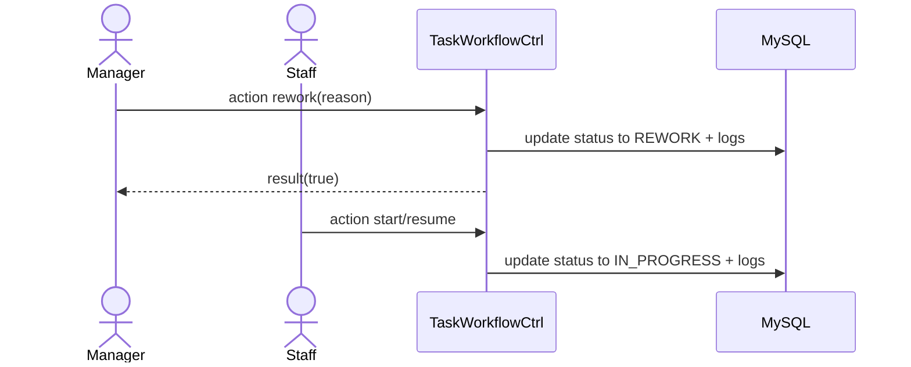

# Story 4.5: Manager yêu cầu làm lại (PENDING_APPROVAL -> REWORK -> IN_PROGRESS)

Status: ready-for-dev

## Story

As a Manager, I want yêu cầu làm lại, so that đảm bảo chất lượng đầu ra trước khi hoàn thành.

## Acceptance Criteria

1. Task ở trạng thái `Chờ duyệt`.
2. Rework phải có lý do.
3. Transition `PENDING_APPROVAL -> REWORK`.
4. Staff có thể đưa về `IN_PROGRESS`.
5. Ghi status log + audit.

## Tasks / Subtasks

- [ ] Endpoint rework.
- [ ] Validate reason.
- [ ] Guard transitions.
- [ ] Persist logs.

## Dev Notes

- Giữ reason trong audit payload.

## Diagrams

### Sequence
- Manager gửi rework + reason.
- API validate, đổi trạng thái REWORK, ghi logs.
- Staff resume về IN_PROGRESS.

### Sequence diagram (Mermaid)

## Dev Agent Record
### Agent Model Used
Codex 5.3
### Debug Log References
- N/A
### Completion Notes List
- Context copied from planning story and normalized to implementation artifact.
### File List
- `_bmad-output/implementation-artifacts/4-5-manager-yeu-cau-lam-lai-pending-approval-rework-in-progress.md`
