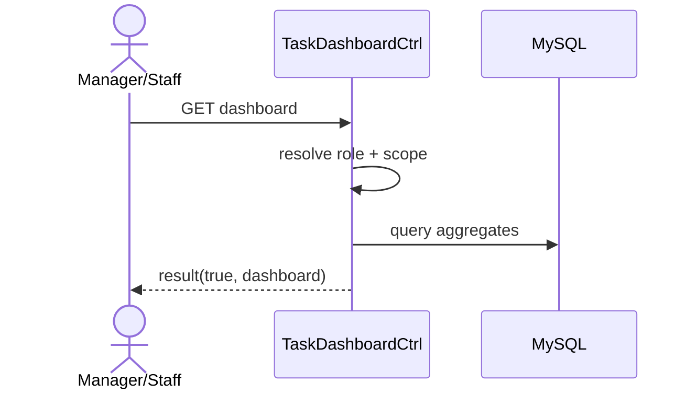

# Story 5.1: API dashboard cá nhân (filters theo role/status/priority)

Status: ready-for-dev

## Story

As a User (Manager/Staff), I want dashboard tổng hợp theo role, so that biết việc cần xử lý trước.

## Acceptance Criteria

1. User đăng nhập hợp lệ.
2. Trả các khối: todo/highPriority/dueSoon/overdue.
3. Manager có thêm pendingApproval.
4. Filter status/priority hoạt động đúng.

## Tasks / Subtasks

- [ ] Endpoint dashboard API.
- [ ] Build aggregates theo role.
- [ ] Filter handling.
- [ ] Optional short cache.
- [ ] Tests.

## Dev Notes

- Dữ liệu dashboard phải khớp nguồn task.

## Diagrams

### Sequence
- User mở dashboard.
- API xác định role/scope.
- Query aggregates và trả payload.

### Sequence diagram (Mermaid)

## Dev Agent Record
### Agent Model Used
Codex 5.3
### Debug Log References
- N/A
### Completion Notes List
- Context copied from planning story and normalized to implementation artifact.
### File List
- `_bmad-output/implementation-artifacts/5-1-api-dashboard-ca-nhan-filters-theo-role-status-priority.md`
