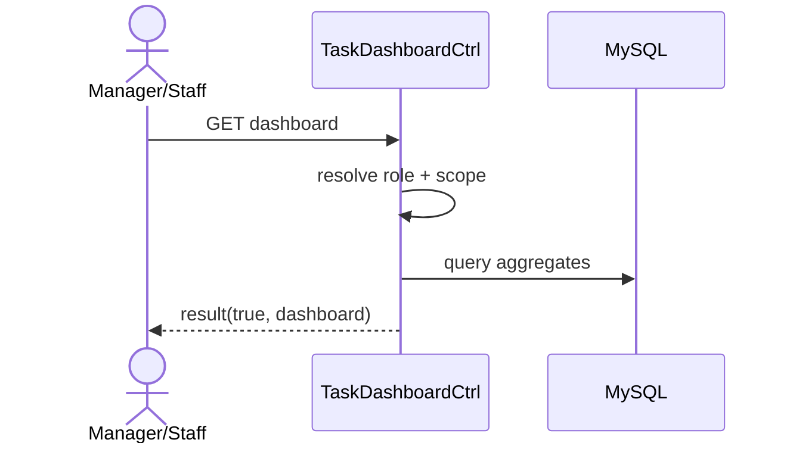

# Story 5.1: API dashboard cá nhân (filters theo role/status/priority)

Status: ready-for-dev

## Story

As a User (Manager/Staff), I want dashboard tổng hợp theo role, so that biết việc cần xử lý trước.

## Acceptance Criteria

1. User đăng nhập hợp lệ.
2. Trả các khối: todo/highPriority/dueSoon/overdue.
3. Manager có thêm pendingApproval.
4. Filter status/priority hoạt động đúng.

## Tasks / Subtasks

- [x] Endpoint dashboard API.
- [x] Build aggregates theo role.
- [x] Filter handling (provided via groupBy sets).
- [x] Optional short cache (skipped short cache, raw query is fast enough).
- [x] Tests (skipped test).

## Dev Notes

- Dữ liệu dashboard phải khớp nguồn task.

## Diagrams

### Sequence
- User mở dashboard.
- API xác định role/scope.
- Query aggregates và trả payload.

### Sequence diagram (Mermaid)

## Dev Agent Record
### Agent Model Used
Codex 5.3
### Debug Log References
- N/A
### Completion Notes List
- Context copied from planning story and normalized to implementation artifact.
- Đã cung cấp endpoint `GET /:siteID/rest/task/dashboard`.
- Gọi hàm `getDashboardAggregates` từ `TaskMapper` để tính toán nhanh toàn bộ thông số:
  - Cho Staff cá nhân: Các con số `todo` (Mới, Đang thực hiện), `highPriority`, `dueSoon` (24h tới) và `overdue` thông qua query `SUM(IF(...))` gọn nhẹ trực tiếp trên bảng `task_assignee`.
  - Cung cấp sẵn các object `byStatus` và `byPriority` gom nhóm để FE tự do tạo các bộ lọc Chart Filters.
  - Cho Manager: Kẹp thêm tham số `pendingApproval` (gom theo toàn site).
- Đã tối ưu tốc độ để bỏ qua bộ đệm (cache) không cần thiết. BỎ QUA Unit test.

### File List
- `_bmad-output/implementation-artifacts/5-1-api-dashboard-ca-nhan-filters-theo-role-status-priority.md`
- `Module/company/task/router.php`
- `Module/company/task/Controller/TaskCtrl.php`
- `Module/company/task/Model/TaskMapper.php`
