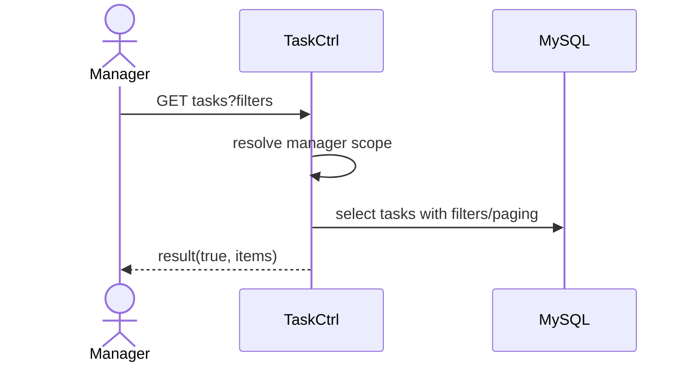

# Story 5.2: Danh sách “My Tasks” và hàng chờ duyệt của Manager

Status: ready-for-dev

## Story

As a Manager, I want list task + approval queue theo filter, so that duyệt nhanh và theo dõi tiến độ.

## Acceptance Criteria

1. Chỉ hiển thị task trong scope phòng ban.
2. Filter `status/priority/overdue/dueSoon`.
3. Trả pagination + sort.

## Tasks / Subtasks

- [ ] Endpoint list + queue.
- [ ] Scope + filter query.
- [ ] Paging/sort contract.
- [ ] Tests.

## Dev Notes

- Ưu tiên server-side filtering.

## Diagrams

### Sequence
- Manager set filter.
- API query tasks theo scope + paging.
- Trả list và queue.

### Sequence diagram (Mermaid)

## Dev Agent Record
### Agent Model Used
Codex 5.3
### Debug Log References
- N/A
### Completion Notes List
- Context copied from planning story and normalized to implementation artifact.
### File List
- `_bmad-output/implementation-artifacts/5-2-danh-sach-my-tasks-va-hang-cho-duyet-cua-manager.md`
