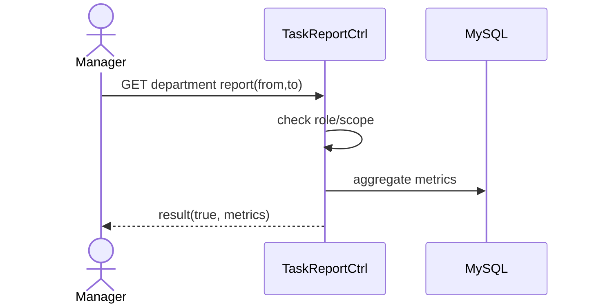

# Story 6.1: API báo cáo tổng hợp theo phòng ban và thời gian

Status: ready-for-dev

## Story

As a Manager, I want báo cáo phòng ban theo thời gian, so that đánh giá hiệu suất công việc.

## Acceptance Criteria

1. Manager chỉ xem trong scope phòng ban.
2. Nhận `fromDate/toDate`.
3. Trả metrics: total, completionRate, overdue, pendingApproval.
4. Số liệu khớp dữ liệu task thực tế.

## Tasks / Subtasks

- [ ] Endpoint report.
- [ ] Scope guard.
- [ ] Aggregate queries.
- [ ] Tests đối chiếu số liệu.

## Dev Notes

- Cân nhắc cache ngắn hạn cho report.

## Diagrams

### Sequence
- Manager chọn khoảng thời gian.
- API check scope + query aggregates.
- Trả metrics.

### Sequence diagram (Mermaid)

## Dev Agent Record
### Agent Model Used
Codex 5.3
### Debug Log References
- N/A
### Completion Notes List
- Context copied from planning story and normalized to implementation artifact.
### File List
- `_bmad-output/implementation-artifacts/6-1-api-bao-cao-tong-hop-theo-phong-ban-va-thoi-gian.md`
