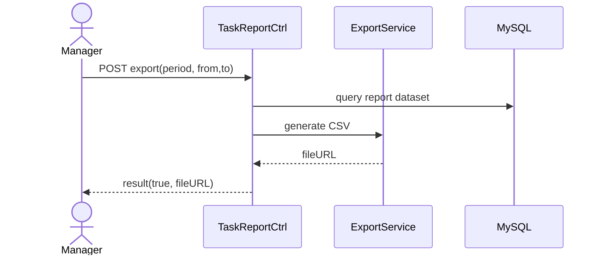

# Story 6.2: Xuất báo cáo theo kỳ (ngày/tuần/tháng)

Status: ready-for-dev

## Story

As a Manager, I want export báo cáo định kỳ, so that chia sẻ/lưu trữ số liệu thuận tiện.

## Acceptance Criteria

1. Export theo day/week/month với phạm vi thời gian hợp lệ.
2. Dữ liệu đúng scope phòng ban.
3. Trả file (vd CSV) hoặc download URL hợp lệ.
4. Ghi log/audit nếu policy yêu cầu.

## Tasks / Subtasks

- [ ] Endpoint export report.
- [ ] Build dataset theo filters/scope.
- [ ] Generate CSV + lưu file.
- [ ] Optional audit/log.
- [ ] Tests.

## Dev Notes

- Reuse query logic từ story 6.1 để tránh lệch số liệu.

## Diagrams

### Sequence
- Manager bấm Export.
- API lấy dataset theo scope/time.
- Generate file, lưu và trả URL.

### Sequence diagram (Mermaid)

## Dev Agent Record
### Agent Model Used
Codex 5.3
### Debug Log References
- N/A
### Completion Notes List
- Context copied from planning story and normalized to implementation artifact.
### File List
- `_bmad-output/implementation-artifacts/6-2-xuat-bao-cao-theo-ky-ngay-tuan-thang.md`
