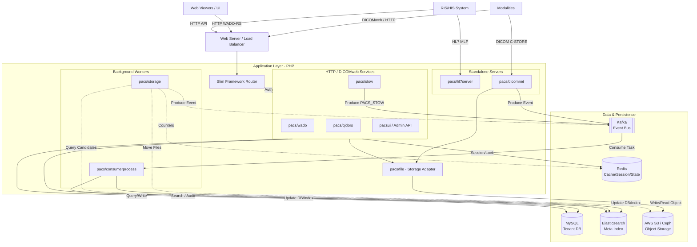

# Architecture Decision Document

_Tài liệu này được xây dựng qua từng bước khám phá cộng tác. Các phần được bổ sung khi chúng ta cùng nhau đưa ra các quyết định kiến trúc._

## Project Context Analysis

### Requirements Overview

**Functional Requirements:**
- DICOM Services: WADO-RS, QIDO-RS, STOW-RS, MWL, DIMSE C-STORE/C-FIND/C-MOVE
- User & Access Management: Multi-role RBAC, JWT + API Key authentication
- Study Management: Search, metadata, thumbnail, annotation
- Storage Lifecycle: 3-tier (ONLINE/NEARLINE/OFFLINE) với auto-migration qua Kafka
- Integration: RIS (HL7/FHIR), HIS, external DICOM AE, viewer integration
- Audit & Compliance: Đầy đủ audit trail, data retention policy
- Multi-site: Per-site database isolation, zone management
- Admin UI (PacsUI): Web portal quản lý hệ thống

**Non-Functional Requirements:**
- Performance: DICOM store/retrieve latency thấp, search nhanh qua Elasticsearch
- Security: HIPAA compliance, encrypted storage, network isolation
- Scalability: Horizontal scaling, multi-tenant, multi-zone
- Reliability: Không mất dữ liệu, storage redundancy
- Availability: Uptime cao cho clinical environment

**Scale & Complexity:**
- Complexity level: Enterprise / High
- Primary domain: Healthcare API Backend + Admin Web App
- Estimated architectural components: 15+ modules

### Technical Constraints & Dependencies

- Brownfield: PHP 8.0 / Slim 2.0 framework (không thể thay đổi runtime)
- DICOM standard compliance bắt buộc
- MySQL per-tenant database model đã được thiết lập
- Elasticsearch cho full-text/metadata search
- Kafka cho async processing pipeline
- AWS S3 / Ceph cho object storage

### Cross-Cutting Concerns Identified

- Multi-tenancy: Mọi request phải route đến đúng tenant DB
- Authentication/Authorization: JWT + API Key, RBAC checks
- Audit Logging: Mọi clinical action phải được ghi log
- Storage Routing: Logic chọn tầng lưu trữ phù hợp
- Rate Limiting: Bảo vệ API khỏi abuse
- Error Handling: Clinical-grade error handling không mất data

## Technical Foundation

### Project Type: Brownfield

Dự án đang hoạt động với tech stack đã được thiết lập. Không áp dụng starter template mới.

### Existing Technical Foundation

**Language & Runtime:** PHP 8.0+
**Framework:** Slim 2.0 (micro-framework, lightweight routing)
**Architecture Pattern:** SOA + Module-based design (company/mvc)

**Data Layer:**
- MySQL 5.7+ — per-tenant DB isolation
- Elasticsearch 7.x — DICOM metadata full-text search
- Redis 7.4+ — session cache, distributed locks, storage routing state

**Infrastructure:**
- Kafka — async event processing (storage migration pipeline)
- AWS S3 / Ceph — object storage cho DICOM files
- Monolog + Fluentd — centralized logging

**Module Organization:**
- `company/` — Core reusable framework (MVC, Auth, SQL, Cache)
- `pacs/` — DICOM service implementations
- `pacsui/` — Admin web portal
- `ris/` — RIS/HIS integration adapters
- `companyui/` — Shared UI components

**Architectural Decisions Pre-established by Existing System:**
- Module isolation via namespace conventions
- Dependency injection through custom container
- Per-tenant database routing at middleware level
- Kafka consumers for background storage jobs
- Redis for distributed state (rate limiting, locks, storage counters)

## Core Architectural Decisions

### Data Architecture

**Tenant Routing Strategy:** URL path parameter `/:siteID`
- siteID truyền qua URL path, Auth validate và route DB per-tenant
- Pattern: `(/:siteID)/rest/:aet(/rs)/studies/:studyIUID`

**Database Migration Strategy:** Per-module SQL files + install.php
- Mỗi module tự quản lý schema trong `sql/*.table.sql`
- Không có automated migration framework

### Authentication & Security

**RBAC Implementation:** Controller-level explicit permission checks
- Pattern: `Auth::getInstance()->setSiteID($siteID)->requirePrivilege('action')`
- Mỗi action tự check quyền trong controller

**Authentication Methods:** JWT (Bearer token) + Session cookie
- JWT: `Auth::verifyBearerToken()` via `HTTP_AUTHORIZATION` header
- Session: PHP session với Redis storage

**Audit Logging:** Async via Fluentd → Elasticsearch
- `AuditLogHandler` extends Monolog, writes qua FluentLogger TCP
- requestID tracking qua `$_SERVER["UNIQUE_ID"]`

### Storage Lifecycle Architecture

**Tier Selection:** Policy-driven via ServiceMapper config
- Admin cấu hình: `limitTime` (age), `startTime/endTime` (time window)
- Hỗ trợ DICOM compression khi migrate (JpegLSLossless, etc.)

**Migration Execution Pattern:** Long-running CLI process + Kafka PROCESS queue
- `moveNearline.php` persistent process với time-window self-throttling
- Publish `MOVE_NEARLINE` → Kafka `PROCESS` topic
- `ConsumerMoveNearlineStorage` processes job
- Redis `MOVE_NEARLINE_COUNTER` tracks progress per processID

### API & Communication

**DICOM API Pattern:** No versioning — DICOMweb standard paths
- URL: `(/:siteID)/rest/:aet(/rs)/studies/:studyIUID`
- siteID là optional prefix identifying tenant context

**RIS/HIS Integration:** Synchronous HTTP REST
- Per-module controller pattern với Auth checks
- Không dùng message queue cho RIS data flow

### Infrastructure & Deployment

**Process Architecture:** PHP-FPM cho HTTP API + long-running CLI consumers
- PHP-FPM: stateless HTTP requests (horizontally scalable)
- CLI processes: persistent consumers (storage migration, Kafka consumers)
- Sessions/state trong Redis (enables horizontal scaling)

**Observability:** Fluentd → ELK + Redis counters
- Structured logging via Monolog → Fluentd → Elasticsearch
- Storage operation counters trong Redis

## Implementation Patterns & Consistency Rules

### Naming Patterns

**Database Naming Conventions:**
- Table: `module_entity` (snake_case, prefix bằng tên module) — ví dụ: `user_department`, `pacs_study`
- Columns: camelCase — ví dụ: `parentID`, `createdDate`, `siteFK`, `dbVersion`
- Foreign keys: `entityFK` — ví dụ: `siteFK`, `depFK`, `privGroupID`
- Primary key: `id` (VARCHAR 50, UUID)
- Indexes: `idx_columnName` — ví dụ: `idx_createdDate`, `idx_parentID`
- SQL files: `module_entity.table.sql`

**API URL Patterns:**
- Tenant-scoped: `/:siteID/rest/:resource(/:id)`
- DICOMweb: `(/:siteID)/rest/:aet(/rs)/studies/:studyIUID`
- Action endpoints: `/:siteID/rest/action/:action`
- Không có version prefix (`/v1/`, `/api/`)

**PHP Naming Conventions:**
- Classes: PascalCase — `StudyMapper`, `AuthCtrl`
- Methods: camelCase — `makeInstance()`, `filterID()`, `getEntity()`
- Constants: UPPER_SNAKE_CASE — `STATUS_NORMAL`, `CACHE_STUDY_LOCK`
- Namespaces: `Vendor\Module\SubModule` — `Pacs\Study\Model\StudyMapper`

**Module File Structure:**
- `Controller/EntityCtrl.php`
- `Model/EntityMapper.php`
- `Model/EntitySqlMapper.php`
- `Model/EntityElasticSearchMapper.php`
- `Lib/EntityFunction.php`
- `Exec/execScript.php`
- `sql/module_entity.table.sql`

### API Response Patterns

**Standard Response:** `result($status, $data, $code)`
```php
// Success
$this->outputJSON(result(true));
$this->outputJSON(result(true, $data));

// Error
$this->outputJSON(result(false, "E001"));
$this->outputJSON(result(false, "message"));
```
JSON output: `{"status": true/false, "data": ..., "code": null}`

Không được trả raw array hay custom structure — luôn dùng `result()`.

### Controller Patterns

**Auth check pattern** (bắt buộc mọi action):
```php
Auth::getInstance()->requireLogin();
Auth::getInstance()->setSiteID($siteID)->requirePrivilege('privilegeName');
```

**Input/Output:**
```php
$input = $this->input();    // đọc request body/params
$this->outputJSON($data);   // trả JSON response
```

### Mapper/Data Access Patterns

**Factory pattern** (không dùng `new`):
```php
EntityMapper::makeInstance()
    ->filterID($id)
    ->getEntity();          // single entity
    ->getEntities();        // collection
    ->getEntityOrFail();    // throws NotFoundException nếu không tìm thấy
```

**Multi-adapter mappers** (DICOM entities):
```php
static function makeSqlMapper()  { return EntitySqlMapper::makeInstance(); }
static function makeCqlMapper()  { return EntityCqlMapper::makeInstance(); }
```

### Exception Patterns

Dùng exceptions từ `Company\Exception\*`:
- `BadRequestException` — input không hợp lệ
- `ForbiddenException` — không đủ quyền
- `NotFoundException` — entity không tồn tại
- `UnauthorizedException` — chưa đăng nhập
- `DatabaseException` — lỗi DB

Framework tự map → HTTP status code tương ứng.

### Module Bootstrap Pattern

Mỗi module có:
- `construct.php` — bootstrap hooks (auto-loaded bởi Bootstrap)
- `install.php` — module installation logic
- `router.php` — route definitions
- `composer.json` — module metadata
- `sql/` — schema files

### Process Patterns (Background Jobs)

**CLI consumer pattern:**
```php
require_once $ROOT_PATH . '/Docroot/index.php';  // bootstrap
// long-running while(true) loop với time-window self-throttling
// publish to Kafka PROCESS topic
// Redis counter for progress tracking
```

**Service config pattern:**
```php
$service = ServiceMapper::makeInstance()->getService("SERVICE_NAME");
$attrs = json_decode($service["attrs"], true);
```

### Enforcement Rules

Tất cả AI agents PHẢI:
- Dùng `result()` helper cho mọi JSON response
- Dùng `makeInstance()` thay vì `new` cho mapper
- Đặt tên table theo `module_entity` (snake_case prefix)
- Đặt tên column theo camelCase (không phải snake_case)
- Check auth theo thứ tự: `requireLogin()` → `setSiteID()` → `requirePrivilege()`
- Throw exceptions từ `Company\Exception\*` (không throw raw `\Exception`)
- Đặt SQL files theo `module_entity.table.sql`
- Không tạo route với version prefix

## Project Structure & Boundaries

### Complete Project Directory Structure

```
pacs2/
├── Docroot/                    # Web entry point
│   ├── index.php               # Bootstrap HTTP app
│   └── index.html
├── Module/                     # Tất cả modules
│   ├── company/                # Core framework (reusable)
│   │   ├── auth/               # JWT + Session authentication
│   │   ├── cache/              # Redis cache driver
│   │   ├── elasticsearch/      # ES client + sync consumers
│   │   ├── encrypt/            # Encryption utilities
│   │   ├── exception/          # Exception types
│   │   ├── file/               # File system abstraction
│   │   ├── kafka/              # Kafka producer/consumer
│   │   ├── license/            # License management
│   │   ├── log/                # Monolog base handlers
│   │   ├── mvc/                # Bootstrap, Router, Controller, Mapper base
│   │   ├── queue/              # Queue abstraction (Kafka-backed)
│   │   ├── queueSql/           # SQL-backed queue
│   │   ├── service/            # Service manager
│   │   ├── session/            # Session storage (Redis)
│   │   ├── setting/            # Config/settings data
│   │   ├── site/               # Multi-site management
│   │   ├── sql/                # DB connection layer
│   │   ├── systemmonitoring/   # Health check, sync status
│   │   ├── user/               # User, role, privilege management
│   │   └── zone/               # Multi-zone management
│   ├── companyui/              # Core admin UI modules
│   │   ├── home/               # Dashboard
│   │   ├── site/               # Site management UI
│   │   ├── user/               # User management UI
│   │   ├── setting/            # Settings UI
│   │   └── queue/              # Queue monitor UI
│   ├── pacs/                   # PACS/DICOM core modules
│   │   ├── wado/               # WADO-RS (retrieve)
│   │   ├── stow/               # STOW-RS (store)
│   │   ├── qidors/             # QIDO-RS (query)
│   │   ├── dicomnet/           # DICOM network (C-STORE/C-FIND/C-MOVE)
│   │   ├── hl7server/          # HL7 MLP server
│   │   ├── mwl/                # Modality Worklist
│   │   ├── study/              # Study management
│   │   ├── series/             # Series management
│   │   ├── instance/           # Instance management
│   │   ├── file/               # File storage abstraction
│   │   ├── storage/            # Storage tier management (ONLINE/NEARLINE/OFFLINE)
│   │   ├── media/              # Non-DICOM media files
│   │   ├── report/             # Radiology reports
│   │   ├── image/              # Image processing
│   │   ├── compression/        # DICOM compression
│   │   ├── dicomtagmorphing/   # Tag modification
│   │   ├── log/                # Audit logging (Fluentd)
│   │   ├── accessmanagement/   # Access control (rate limiting)
│   │   ├── ae/                 # AE Title management
│   │   ├── ai/                 # AI integration
│   │   ├── viewer/             # Viewer integration
│   │   ├── publiclink/         # Public share links
│   │   ├── integration/        # External system adapters
│   │   ├── queryretrieve/      # DICOM Q/R helpers
│   │   ├── consumerprocess/    # Consumer process runner
│   │   ├── dbadaptermapper/    # Multi-DB adapter base
│   │   ├── dicom/              # DICOM parsing/building library
│   │   ├── setting/            # PACS settings
│   │   ├── studylog/           # Study activity log
│   │   └── tool/               # Utility tools
│   ├── pacsui/                 # PACS admin UI modules
│   │   ├── study/              # Study management UI
│   │   ├── storage/            # Storage management UI
│   │   ├── ae/                 # AE management UI
│   │   ├── log/                # Audit log UI
│   │   ├── setting/            # PACS settings UI
│   │   ├── viewer/             # Viewer UI
│   │   ├── report/             # Report UI
│   │   ├── mwl/                # MWL UI
│   │   └── zone/               # Zone management UI
│   └── ris/                    # RIS integration modules
│       ├── duty/               # Duty/schedule management
│       └── setting/            # RIS settings
├── Config/                     # Application configuration
├── sql/                        # Global SQL migrations
├── install/                    # Installation scripts
├── vendor/                     # Composer dependencies
├── tests/                      # PHPUnit tests
├── docs/                       # Project documentation
├── composer.json
├── construct.php               # Global bootstrap hooks
└── startup.sh
```

### Architectural Boundaries

**API Boundaries:**
- HTTP API: `Docroot/index.php` → Router → Controller
- DICOM Network: `pacs/dicomnet/Exec/DicomServer/start.php` (standalone)
- HL7 Server: `pacs/hl7server/` (standalone TCP server)
- Consumer processes: `pacs/consumerprocess/Exec/` (standalone CLI)

**Storage Tier Boundaries:**
- ONLINE: local disk / fast S3 — `pacs/file/`, `pacs/storage/`
- NEARLINE: cold S3 / Ceph — `pacs/storage/Exec/moveNearline.php`
- OFFLINE: tape / archive — `pacs/storage/Exec/moveOffline.php`

**Data Access Boundaries:**
- MySQL per-tenant: `company/sql/` → per-site DB connection
- Elasticsearch: `company/elasticsearch/` → `pacs/*/Model/*ElasticSearchMapper.php`
- Redis: `company/cache/` → session, locks, counters
- Object storage (S3/Ceph): `pacs/file/` abstraction layer

### Requirements to Structure Mapping

| PRD Requirement | Module(s) |
|---|---|
| DICOM WADO-RS | `pacs/wado/` |
| DICOM STOW-RS | `pacs/stow/` |
| DICOM QIDO-RS | `pacs/qidors/` |
| DICOM Net (C-STORE/C-FIND/C-MOVE) | `pacs/dicomnet/` |
| Modality Worklist (MWL) | `pacs/mwl/` |
| Study Management | `pacs/study/`, `pacs/series/`, `pacs/instance/` |
| Storage Lifecycle | `pacs/storage/` |
| User & RBAC | `company/user/`, `company/auth/` |
| Audit Logging | `pacs/log/` |
| RIS Integration | `pacs/ris/`, `module/ris/` |
| HL7 Server | `pacs/hl7server/` |
| Multi-site & Zone | `company/site/`, `company/zone/` |
| Admin UI | `pacsui/*`, `companyui/*` |
| AI features | `pacs/ai/` |
| Public sharing | `pacs/publiclink/` |
| Reports | `pacs/report/` |

### Integration Points

**Internal Communication:**
- HTTP: Slim router → Controller → Mapper
- Async: Controller/CLI → Kafka Producer → Consumer process → Mapper

**External Integrations:**
- DICOM AE: `pacs/dicomnet/` (C-STORE, C-FIND, C-MOVE, N-ACTION)
- HL7 MLP: `pacs/hl7server/` (MWL queries from RIS)
- Object Storage: `pacs/file/` → AWS S3 SDK / Ceph S3-compatible
- Viewers: `pacs/viewer/` → Oviyam, Orthanc, external WADO-RS

### System Component Flow Diagram



**Data Flow — DICOM Store:**
```
Modality → STOW-RS/C-STORE → pacs/stow → pacs/file (write S3)
→ Kafka PACS_STOW → consumer → pacs/instance (index ES + MySQL)
```

**Data Flow — Storage Migration:**
```
moveNearline.php → query ES (ONLINE files) → copy to NEARLINE S3
→ Redis move_nearline_data → ConsumerMoveNearlineStorage → update DB
```

## Architecture Validation Results

### Coherence Validation ✅

**Decision Compatibility:** Tất cả quyết định tương thích nhau
- PHP-FPM stateless + Redis sessions → horizontal scaling khả thi
- JWT Bearer token → chuẩn DICOMweb authentication
- Kafka async pipeline + MySQL sync writes → phân tách roles rõ ràng
- siteID URL path → nhất quán qua tất cả tenant-scoped routes

**Notable:** Routes có `(/:siteID)` optional dành cho cross-site operations;
`/:siteID` bắt buộc dành cho tenant-scoped data access.

### Requirements Coverage Validation ✅

**Functional Requirements:** Tất cả 24 FR categories có module tương ứng
**NFRs:**
- Performance: Redis cache + Elasticsearch + Kafka async pipeline
- Security: RBAC controller-level + JWT + Fluentd audit trail
- Scalability: PHP-FPM stateless + per-tenant DB + Redis distributed state
- DICOM compliance: DICOMweb standard paths (WADO/STOW/QIDO)
- Reliability: Kafka consumer retry + Redis counters + storage redundancy

### Gap Analysis

**Important:**
- Test conventions chưa định nghĩa — `tests/` folder tồn tại nhưng chưa có pattern convention cho AI agents
- `Config/` structure chưa được document chi tiết

**Minor:**
- `pacs/swooleserver/` là legacy module, không còn sử dụng — treat as deprecated

### Architecture Completeness Checklist

- [x] **Requirements Analysis** — Context, scale, constraints, cross-cutting concerns
- [x] **Architectural Decisions** — Data arch, auth/security, storage lifecycle, API, infrastructure
- [x] **Implementation Patterns** — Naming, response format, controller, mapper, exception, bootstrap, process
- [x] **Project Structure** — Module tree đầy đủ, boundaries, integration points, FR mapping

### Architecture Readiness Assessment

**Overall Status: READY FOR IMPLEMENTATION**

**Confidence Level:** High

**Key Strengths:**
- Brownfield project với patterns đã được battle-tested trong production
- Module isolation rõ ràng, dễ thêm feature mới mà không ảnh hưởng core
- Async pipeline (Kafka) tách biệt storage migration khỏi HTTP request cycle
- Per-tenant DB isolation đảm bảo data security và compliance

**Areas for Future Enhancement:**
- Automated migration framework (thay thế manual SQL files)
- Test coverage conventions cho `tests/`
- OpenAPI/Swagger documentation cho REST endpoints
