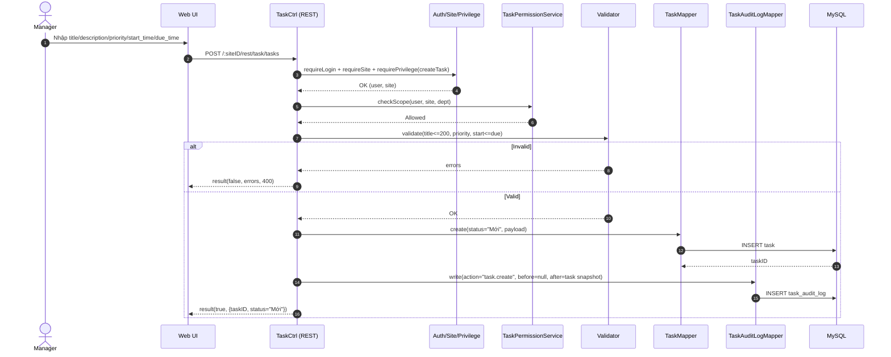

# Story 1.1: Tạo task (API + validation + lưu DB)

As a Manager,  
I want tạo một task mới với tiêu đề/mô tả/ưu tiên/mốc thời gian cơ bản,  
So that tôi có thể giao việc và bắt đầu theo dõi công việc trong hệ thống.

## Acceptance Criteria

**Given** Manager đã đăng nhập, đã chọn `siteID`, và có quyền tạo task trong phạm vi phòng ban  
**When** gọi API tạo task với `title` (<= 200 ký tự), `description`, `priority` ∈ {Thấp, Vừa, Cao}, `start_time`, `due_time`  
**Then** hệ thống validate dữ liệu (bao gồm `start_time <= due_time`) và tạo bản ghi `task` với trạng thái mặc định `Mới`  
**And** response trả về theo wrapper chuẩn `result(true, data)`; task xuất hiện ngay trong danh sách của người tạo, và sẽ xuất hiện trong danh sách người nhận sau khi thực hiện thao tác gán người nhận  
**And** ghi audit log cho sự kiện “tạo task” (actor, timestamp, before/after phù hợp)

## Diagrams

### Sequence

- **Actor**: Manager
- **UI**: Task Create Form
- **API**: `TaskCtrl.createTask`
- **Checks**: `requireLogin()` → `requireSite(siteID)` → `requirePrivilege(createTask)` → scope theo phòng ban
- **Writes**: `task` + `task_audit_log`
- **Response**: `result(true, {taskID, status, ...})`

### Sequence diagram (Mermaid)

