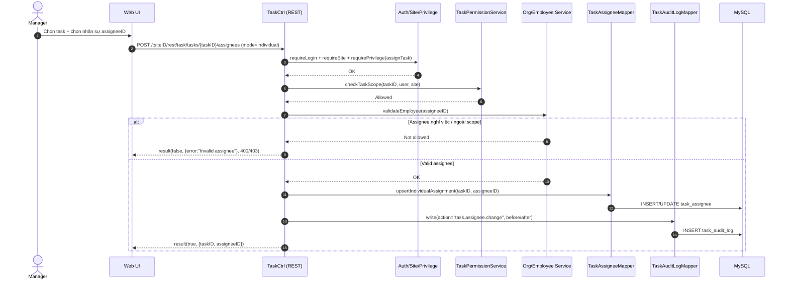

# Story 1.2: Giao task cho cá nhân (assignee đơn)

As a Manager,  
I want giao task cho một nhân viên cụ thể,  
So that tôi có một người chịu trách nhiệm rõ ràng cho công việc đó.

## Acceptance Criteria

**Given** task tồn tại và Manager có quyền quản lý task trong phạm vi phòng ban  
**When** gán `assigneeID` cho task theo chế độ “Cá nhân”  
**Then** hệ thống từ chối nếu nhân sự có trạng thái `Đã nghỉ việc` hoặc không thuộc scope phòng ban cho phép  
**And** hệ thống lưu quan hệ gán vào `task_assignee` (hoặc cấu trúc dữ liệu tương đương theo module) và ghi audit “đổi người nhận”  
**And** danh sách người nhận có thể truy vết (kèm thời điểm gán) trong lịch sử task

## Diagrams

### Sequence

- **Actor**: Manager
- **Mục tiêu**: gán 1 `assigneeID` cho task (chế độ cá nhân)
- **Checks**: auth/site/privilege + scope theo phòng ban + trạng thái nhân sự (không `Đã nghỉ việc`)
- **Writes**: `task_assignee` + audit “đổi người nhận”
- **Response**: `result(true, ...)` hoặc `result(false, ..., 403/400)`

### Sequence diagram (Mermaid)

