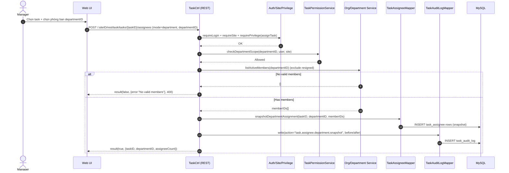

# Story 1.3: Giao task cho phòng ban (snapshot thành viên)

As a Manager,  
I want giao task cho cả phòng ban,  
So that mọi thành viên hợp lệ trong phòng đều nhận được công việc tại thời điểm giao.

## Acceptance Criteria

**Given** task tồn tại và Manager có quyền giao việc trong phòng ban mục tiêu  
**When** chọn “Phòng ban” và cung cấp `departmentID` để giao task  
**Then** hệ thống resolve danh sách thành viên hợp lệ tại thời điểm giao (loại `Đã nghỉ việc`) và tạo snapshot người nhận  
**And** nếu không có thành viên hợp lệ thì hệ thống cảnh báo và từ chối thao tác  
**And** hệ thống lưu được chế độ giao việc + snapshot người nhận (phục vụ audit/truy vết)

## Diagrams

### Sequence

- **Actor**: Manager
- **Mục tiêu**: giao task cho `departmentID` và snapshot danh sách thành viên hợp lệ tại thời điểm giao
- **Checks**: auth/site/privilege + scope phòng ban mục tiêu + phòng ban phải có thành viên hợp lệ
- **Reads**: danh sách nhân sự phòng ban (loại `Đã nghỉ việc`)
- **Writes**: snapshot assignees + audit log
- **Response**: `result(true, {assigneeCount,...})` hoặc `result(false, ..., 400/403)`

### Sequence diagram (Mermaid)

