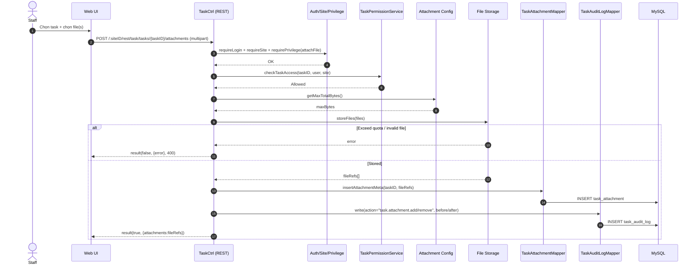

# Story 1.4: Đính kèm tệp cho task

As a Staff,  
I want đính kèm nhiều tệp vào task,  
So that tôi có thể bổ sung tài liệu/ket quả làm việc phục vụ xử lý và phê duyệt.

## Acceptance Criteria

**Given** người dùng có quyền truy cập task và hệ thống có cấu hình giới hạn tổng dung lượng đính kèm  
**When** upload/đính kèm một hoặc nhiều tệp vào task  
**Then** hệ thống lưu metadata tệp (tên, kích thước, loại, người upload, thời gian) và liên kết đúng với `task_id`  
**And** tổng dung lượng đính kèm vượt giới hạn cấu hình thì hệ thống từ chối với lỗi rõ ràng  
**And** ghi audit log cho thao tác thêm/xóa tệp đính kèm

## Diagrams

### Sequence

- **Actor**: Staff
- **Mục tiêu**: upload/attach nhiều file vào task, kiểm soát tổng dung lượng theo cấu hình
- **Checks**: auth/site/privilege + quyền truy cập task + quota tổng dung lượng
- **Writes**: `task_attachment` (metadata + link task) + audit log
- **Response**: `result(true, attachmentMeta[])` hoặc `result(false, ..., 400/403)`

### Sequence diagram (Mermaid)

