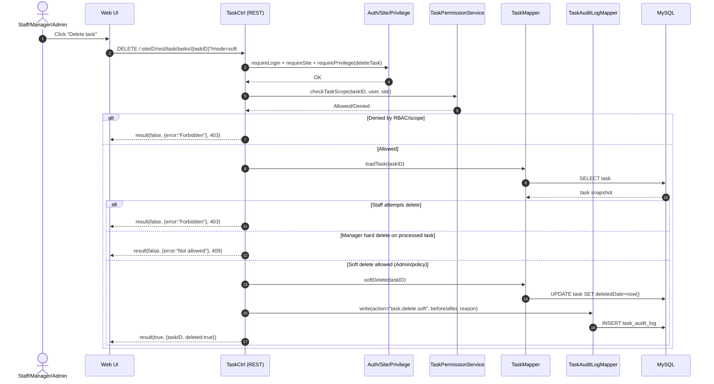

# Story 1.5: Ràng buộc thao tác xóa task (soft delete/lock theo quyền)

As an Admin,  
I want kiểm soát việc xóa task theo phân quyền và trạng thái xử lý,  
So that dữ liệu và lịch sử nghiệp vụ không bị mất sai quy định.

## Acceptance Criteria

**Given** có request xóa task  
**When** actor là Staff cố gắng xóa task đã được giao  
**Then** hệ thống từ chối với lỗi phân quyền phù hợp  
**And** khi actor là Manager và task đã phát sinh xử lý thì hệ thống không cho phép xóa cứng (trừ quyền Admin)  
**And** khi thực hiện xóa logic (nếu được phép) thì bắt buộc có xác nhận + ghi audit log before/after (kèm reason nếu có)

## Diagrams

### Sequence

- **Actor**: Staff / Manager / Admin
- **Mục tiêu**: enforce rule xóa task (staff không được xóa; manager không được xóa cứng nếu đã phát sinh xử lý; admin có thể soft delete theo policy)
- **Checks**: auth/site/privilege + scope + rule theo role + trạng thái/đã phát sinh xử lý
- **Writes**: soft delete/lock (nếu cho phép) + audit log (before/after + reason)
- **Response**: `result(true, ...)` hoặc `result(false, ..., 403/409)`

### Sequence diagram (Mermaid)

