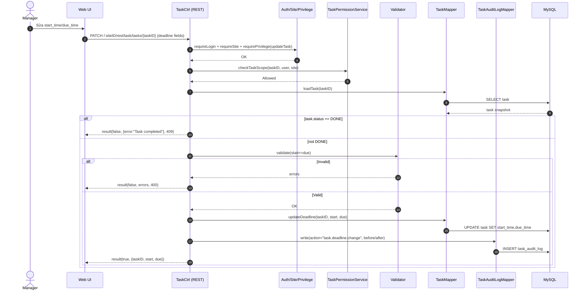

# Story 2.1: Cập nhật deadline task và hiển thị trạng thái sắp quá hạn/quá hạn

As a Manager,  
I want cập nhật deadline của task trước khi hoàn thành,  
So that tôi có thể điều chỉnh kế hoạch mà vẫn giữ đúng ràng buộc nghiệp vụ.

## Acceptance Criteria

**Given** task chưa ở trạng thái `Hoàn thành` và Manager có quyền trong scope  
**When** cập nhật `start_time`/`due_time`  
**Then** hệ thống validate `start_time <= due_time` và lưu thay đổi  
**And** ghi audit log (before/after) cho “đổi deadline”  
**And** task sắp quá hạn/quá hạn được đánh dấu rõ ràng (theo mốc cấu hình) trên dữ liệu trả về cho dashboard/list

## Diagrams

### Sequence

- **Actor**: Manager
- **Mục tiêu**: update `start_time`/`due_time` trước khi `Hoàn thành`, validate `start<=due`
- **Checks**: auth/site/privilege + scope + task.status != DONE
- **Writes**: `task` (deadline fields) + audit “đổi deadline”
- **Response**: `result(true, {taskID,...})`

### Sequence diagram (Mermaid)

