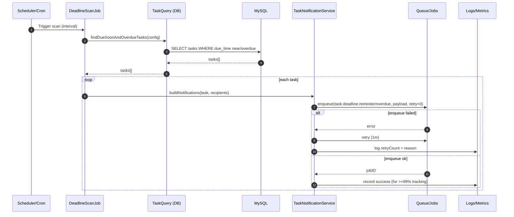

# Story 2.2: Job thông báo sắp quá hạn và quá hạn (async + retry)

As a System,  
I want tự động gửi thông báo sắp quá hạn và quá hạn theo lịch quét,  
So that người liên quan nhận cảnh báo đúng mốc và giảm task trễ hạn.

## Acceptance Criteria

**Given** hệ thống có cơ chế queue/scheduler hiện hữu  
**When** job quét deadline chạy theo lịch  
**Then** hệ thống enqueue notification cho các mốc “sắp quá hạn” (ví dụ 24h) và “đã quá hạn” theo cấu hình  
**And** áp dụng retry policy 1m -> 5m -> 15m, tối đa 3 lần và ghi nhận số lần retry  
**And** tỷ lệ gửi thành công được đo lường/ghi log phục vụ thống kê vận hành

## Diagrams

### Sequence

- **Actor**: Scheduler/Queue (System)
- **Mục tiêu**: scan tasks, enqueue notify “due soon” & “overdue”, retry 1m→5m→15m (max 3)
- **Reads**: task deadlines + recipients (assignees/managers)
- **Writes**: notification jobs + retry tracking/log/metrics

### Sequence diagram (Mermaid)

