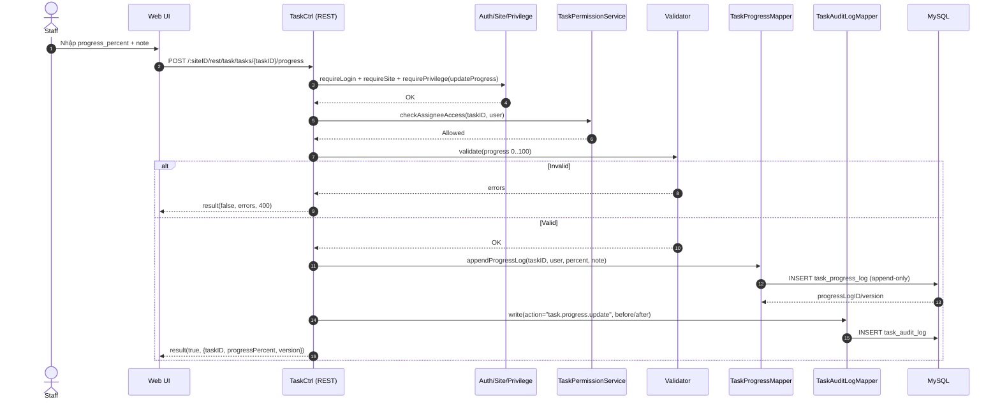

# Story 3.1: Cập nhật tiến độ (0-100) và nội dung thực hiện

As a Staff,  
I want cập nhật % tiến độ và nội dung thực hiện của task,  
So that Manager có thể theo dõi tình trạng công việc theo thời gian.

## Acceptance Criteria

**Given** Staff là người được gán task (cá nhân hoặc thuộc snapshot phòng ban) và có quyền truy cập task  
**When** gửi cập nhật tiến độ với `progress_percent` trong [0..100] và `note`  
**Then** hệ thống validate dữ liệu và lưu bản ghi log tiến độ (append-only) kèm actor + timestamp  
**And** Manager xem được tiến độ mới nhất và lịch sử thay đổi  
**And** ghi audit log cho sự kiện cập nhật tiến độ

## Diagrams

### Sequence

- **Actor**: Staff
- **Mục tiêu**: ghi log tiến độ append-only (`task_progress_log`), progress ∈ [0..100]
- **Checks**: auth/site/privilege + quyền là assignee (cá nhân hoặc thuộc snapshot phòng ban)
- **Writes**: progress log + audit log
- **Response**: `result(true, {progressVersion,...})`

### Sequence diagram (Mermaid)

