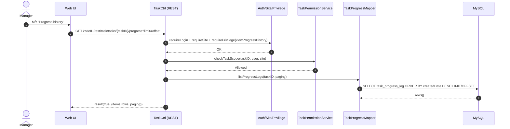

# Story 3.2: Truy vấn lịch sử cập nhật tiến độ theo phiên bản

As a Manager,  
I want xem lịch sử các lần cập nhật tiến độ của task,  
So that tôi có thể truy vết ai cập nhật gì và khi nào.

## Acceptance Criteria

**Given** Manager có quyền xem task trong scope phòng ban  
**When** mở lịch sử tiến độ của task  
**Then** hệ thống trả về danh sách phiên bản cập nhật (thời gian, người cập nhật, % tiến độ, nội dung)  
**And** dữ liệu trả về có thể phân trang nếu số lượng log lớn

## Diagrams

### Sequence

- **Actor**: Manager
- **Mục tiêu**: xem lịch sử progress theo phiên bản, có thể phân trang
- **Checks**: auth/site/privilege + scope phòng ban
- **Reads**: `task_progress_log` (append-only)
- **Response**: `result(true, {items, paging})`

### Sequence diagram (Mermaid)

