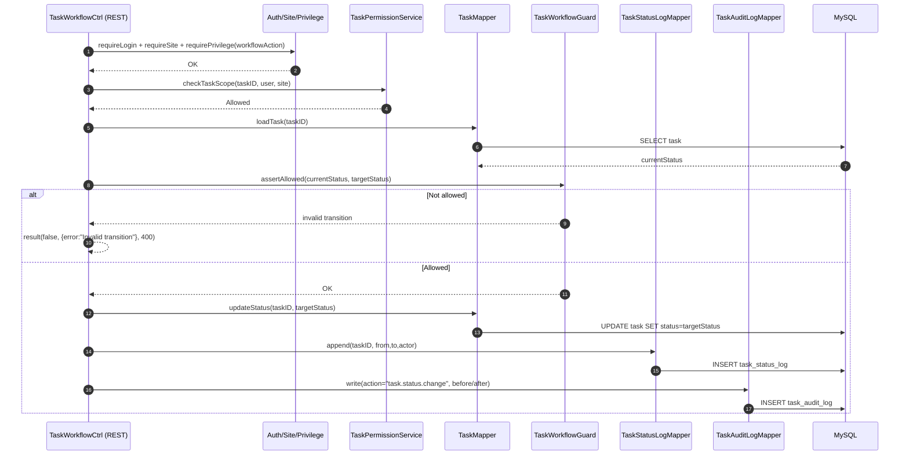

# Story 4.1: Workflow guard cho state machine task

As a System,  
I want enforce state machine cho mọi chuyển trạng thái task qua một guard chung,  
So that không có trường hợp nhảy trạng thái bất hợp lệ qua API/UI.

## Acceptance Criteria

**Given** có request chuyển trạng thái task  
**When** thực hiện transition  
**Then** hệ thống chỉ cho phép các cạnh hợp lệ: `Mới -> Đang làm -> Chờ duyệt -> Hoàn thành` và `Chờ duyệt -> Làm lại -> Đang làm`  
**And** mọi transition đều đi qua một service/guard duy nhất (không hardcode rải rác)  
**And** mọi transition đều ghi status log + audit log (actor, timestamp)

## Diagrams

### Sequence

- **Actor**: API layer (System)
- **Mục tiêu**: mọi action transition phải gọi `TaskWorkflowGuard` để validate cạnh hợp lệ
- **Inputs**: `taskID`, `fromStatus`, `toStatus`, `actor`
- **Writes (on success)**: `task.status` + `task_status_log` + `task_audit_log`
- **Failure**: invalid transition → `result(false, ..., 400)`

### Sequence diagram (Mermaid)

