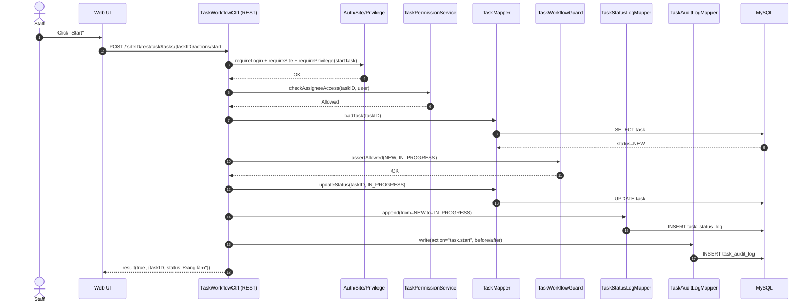

# Story 4.2: Staff bắt đầu làm task (NEW -> IN_PROGRESS)

As a Staff,  
I want chuyển task sang trạng thái `Đang làm`,  
So that hệ thống ghi nhận tôi đã bắt đầu xử lý công việc.

## Acceptance Criteria

**Given** task đang ở trạng thái `Mới` và Staff là người được gán  
**When** gọi action “start”  
**Then** task chuyển sang `Đang làm` nếu hợp lệ theo workflow guard  
**And** hệ thống ghi status log + audit log

## Diagrams

### Sequence

- **Actor**: Staff
- **Mục tiêu**: action `start` chuyển `Mới -> Đang làm` qua guard, ghi status log + audit
- **Checks**: auth/site/privilege + assignee access + guard
- **Writes**: `task.status`, `task_status_log`, `task_audit_log`

### Sequence diagram (Mermaid)

