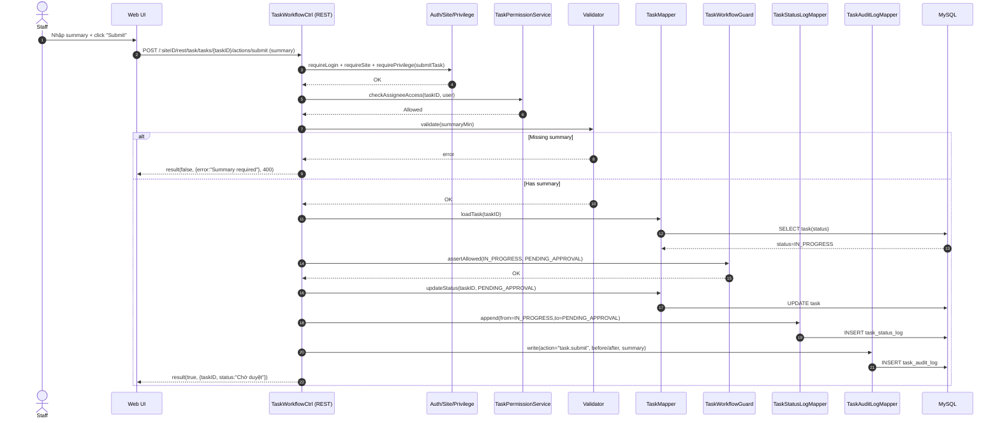

# Story 4.3: Staff gửi duyệt kết quả (IN_PROGRESS -> PENDING_APPROVAL)

As a Staff,  
I want gửi duyệt kết quả của task,  
So that Manager có thể kiểm tra và phê duyệt theo quy trình.

## Acceptance Criteria

**Given** task đang ở trạng thái `Đang làm`  
**When** Staff gọi action “submit” kèm kết quả/ghi chú tổng kết tối thiểu  
**Then** hệ thống từ chối nếu thiếu nội dung tổng kết tối thiểu  
**And** nếu hợp lệ, task chuyển sang `Chờ duyệt` và ghi status log + audit log

## Diagrams

### Sequence

- **Actor**: Staff
- **Mục tiêu**: action `submit` chuyển `Đang làm -> Chờ duyệt`, bắt buộc có summary tối thiểu
- **Checks**: auth/site/privilege + assignee access + validate summary + guard
- **Writes**: status update + status log + audit log

### Sequence diagram (Mermaid)

