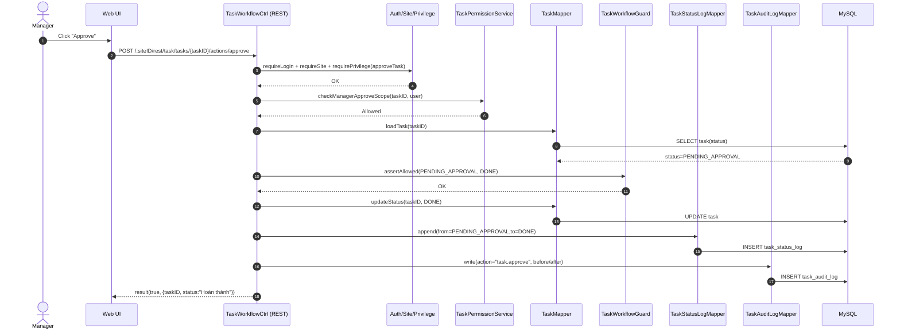

# Story 4.4: Manager phê duyệt task (PENDING_APPROVAL -> DONE)

As a Manager,  
I want phê duyệt kết quả task đang `Chờ duyệt`,  
So that task được kết thúc đúng quy trình và phản ánh vào báo cáo.

## Acceptance Criteria

**Given** task đang ở trạng thái `Chờ duyệt` và Manager có quyền duyệt  
**When** gọi action “approve”  
**Then** task chuyển sang `Hoàn thành`  
**And** hệ thống ghi status log + audit log  
**And** task `Hoàn thành` không cho phép sửa nội dung chính (theo rule) ngoài các ghi chú hệ thống nếu có

## Diagrams

### Sequence

- **Actor**: Manager
- **Mục tiêu**: action `approve` chuyển `Chờ duyệt -> Hoàn thành`
- **Checks**: auth/site/privilege + manager approval permission + guard
- **Writes**: status update + status log + audit log + (rule) khóa sửa nội dung chính sau DONE

### Sequence diagram (Mermaid)

