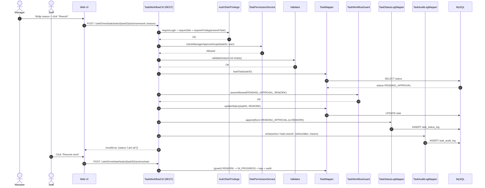

# Story 4.5: Manager yêu cầu làm lại (PENDING_APPROVAL -> REWORK -> IN_PROGRESS)

As a Manager,  
I want yêu cầu Staff làm lại kết quả task,  
So that chất lượng đầu ra được đảm bảo trước khi hoàn thành.

## Acceptance Criteria

**Given** task đang ở trạng thái `Chờ duyệt`  
**When** Manager gọi action “rework” kèm lý do  
**Then** task chuyển sang `Làm lại` và ghi status log + audit log  
**And** Staff có thể đưa task quay lại `Đang làm` theo workflow guard

## Diagrams

### Sequence

- **Actor**: Manager (rework) + Staff (resume)
- **Mục tiêu**: `Chờ duyệt -> Làm lại` (kèm lý do), sau đó Staff đưa về `Đang làm`
- **Checks**: auth/site/privilege + manager approve scope + guard + validate reason
- **Writes**: status update + status log + audit log

### Sequence diagram (Mermaid)

