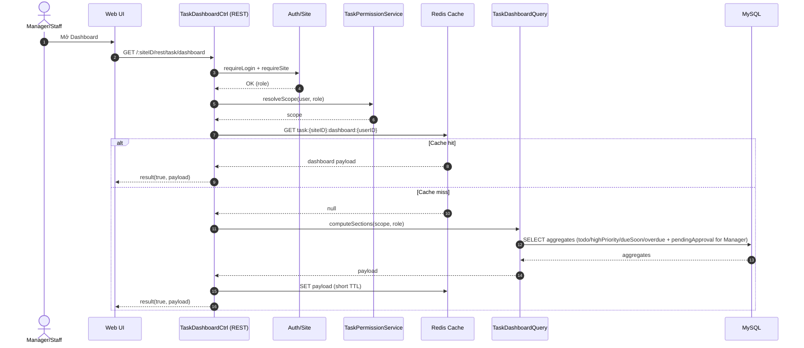

# Story 5.1: API dashboard cá nhân (filters theo role/status/priority)

As a User (Manager/Staff),  
I want xem dashboard cá nhân tổng hợp task theo vai trò,  
So that tôi biết ngay việc nào cần xử lý trước.

## Acceptance Criteria

**Given** user đã đăng nhập và có role hợp lệ  
**When** gọi API dashboard cá nhân  
**Then** hệ thống trả về tối thiểu: việc cần làm ngay, ưu tiên cao, sắp quá hạn/quá hạn  
**And** nếu user là Manager thì có thêm khối “đang chờ duyệt”  
**And** bộ lọc theo trạng thái/ưu tiên hoạt động đúng và dữ liệu khớp nguồn task

## Diagrams

### Sequence

- **Actor**: Manager/Staff
- **Mục tiêu**: lấy dashboard counters/sections theo role (bao gồm pending approval cho Manager)
- **Checks**: auth/site/role + scope phòng ban (Manager) / assignee scope (Staff)
- **Reads**: task list + aggregates (có thể cache Redis theo architecture)
- **Response**: `result(true, {sections...})`

### Sequence diagram (Mermaid)

