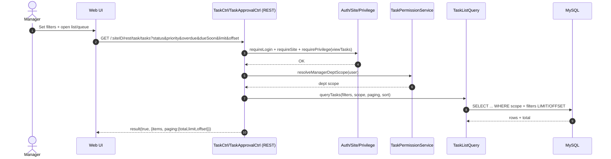

# Story 5.2: Danh sách “My Tasks” và hàng chờ duyệt của Manager

As a Manager,  
I want xem danh sách task theo trạng thái và hàng chờ duyệt,  
So that tôi có thể duyệt nhanh và theo dõi tiến độ phòng ban.

## Acceptance Criteria

**Given** Manager có scope phòng ban  
**When** lọc danh sách theo `status`/`priority`/`overdue`/`dueSoon`  
**Then** hệ thống trả về danh sách phân trang + sort (nếu có) theo chuẩn API hiện hữu  
**And** chỉ hiển thị các task trong phạm vi phòng ban được phép

## Diagrams

### Sequence

- **Actor**: Manager
- **Mục tiêu**: truy vấn “My Tasks” + approval queue theo filter `status/priority/overdue/dueSoon`, có paging/sort
- **Checks**: auth/site/privilege + scope phòng ban
- **Reads**: tasks (server-side filtering)
- **Response**: `result(true, {items, paging, sort})`

### Sequence diagram (Mermaid)

