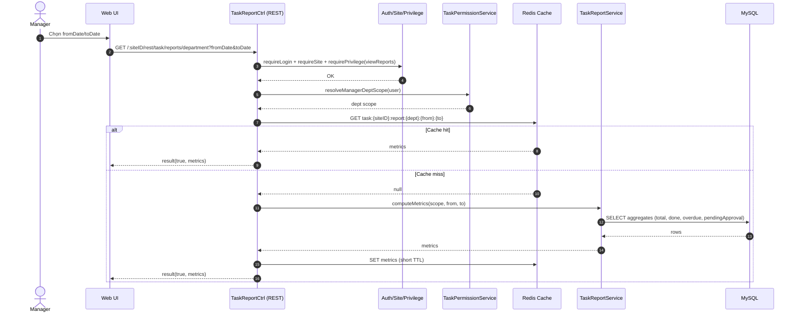

# Story 6.1: API báo cáo tổng hợp theo phòng ban và thời gian

As a Manager,  
I want xem báo cáo tiến độ phòng ban theo khoảng thời gian,  
So that tôi đánh giá hiệu suất và tình trạng công việc của phòng ban.

## Acceptance Criteria

**Given** Manager có quyền xem báo cáo phòng ban trong scope  
**When** gọi API report với bộ lọc thời gian (`fromDate`, `toDate`)  
**Then** hệ thống trả về các chỉ số tối thiểu: tổng task, tỷ lệ hoàn thành, số quá hạn, số chờ duyệt  
**And** số liệu trùng khớp dữ liệu task thực tế

## Diagrams

### Sequence

- **Actor**: Manager
- **Mục tiêu**: lấy metrics theo phòng ban + khoảng thời gian (total, completionRate, overdueCount, pendingApprovalCount)
- **Checks**: auth/site/privilege + scope phòng ban
- **Reads**: aggregates từ `task` (+ logs nếu cần), tối ưu query/cache theo architecture
- **Response**: `result(true, {metrics,...})`

### Sequence diagram (Mermaid)

