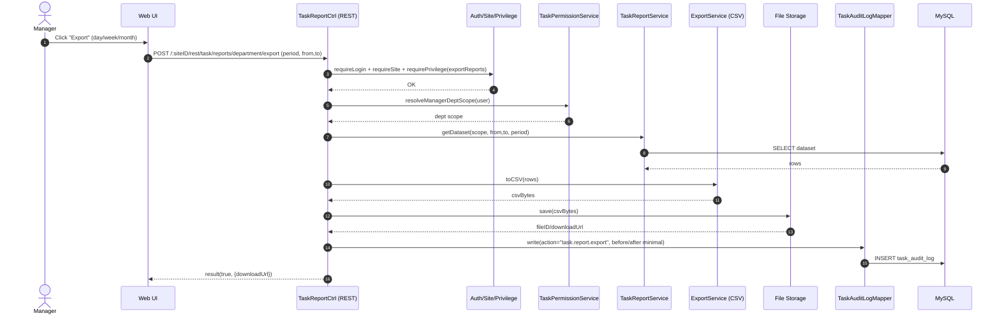

# Story 6.2: Xuất báo cáo theo kỳ (ngày/tuần/tháng)

As a Manager,  
I want xuất báo cáo theo kỳ,  
So that tôi có thể chia sẻ số liệu và lưu trữ báo cáo định kỳ.

## Acceptance Criteria

**Given** Manager đang xem báo cáo theo bộ lọc thời gian  
**When** chọn xuất báo cáo theo kỳ (ngày/tuần/tháng)  
**Then** hệ thống tạo file export (ví dụ CSV) với dữ liệu đúng phạm vi phòng ban và thời gian  
**And** hành động export được ghi log/audit theo chuẩn hệ thống nếu yêu cầu

## Diagrams

### Sequence

- **Actor**: Manager
- **Mục tiêu**: export report theo kỳ (ngày/tuần/tháng) thành file (ví dụ CSV) đúng scope + time range
- **Checks**: auth/site/privilege + scope phòng ban
- **Reads**: report dataset theo filters
- **Writes**: file export (storage) + (optional) audit/log
- **Response**: `result(true, {downloadUrl|fileID})`

### Sequence diagram (Mermaid)

