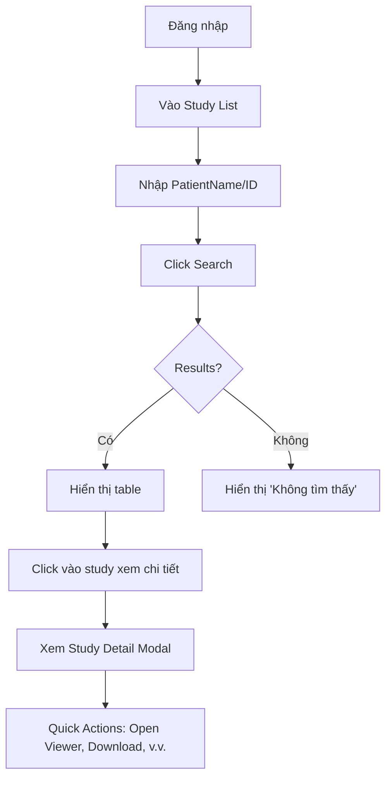
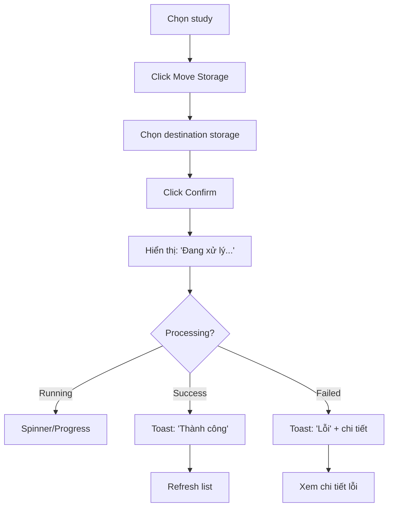
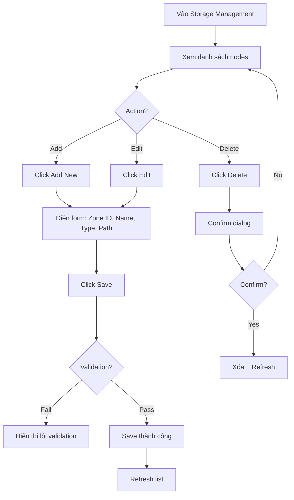
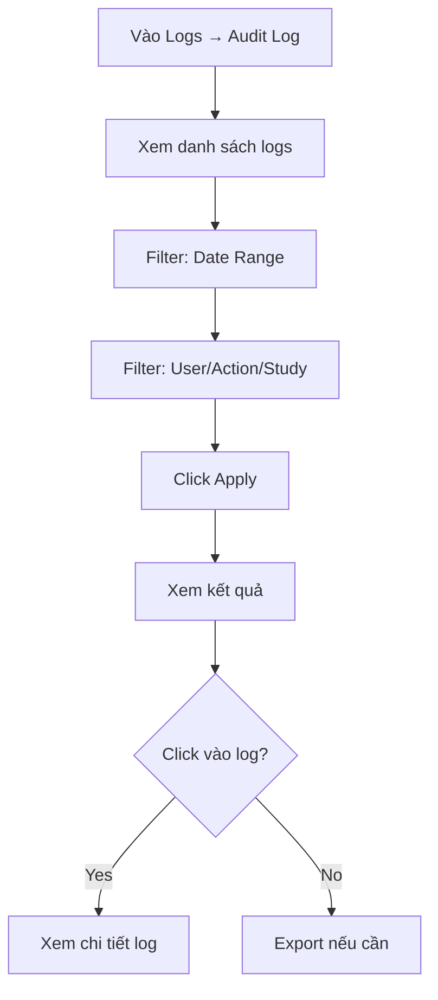

# UX Design Specification pacs2

**Author:** USER
**Date:** 2026-03-09

---

## Executive Summary

### Project Vision

**PACS2** là hệ thống PACS (Picture Archiving and Communication System) - Hệ thống Lưu trữ và Truyền thông Hình ảnh Y tế phiên bản **v1.10** đang vận hành trong môi trường sản xuất. Hệ thống cung cấp các DICOM services chuẩn hóa (WADO-RS, QIDO-RS, STOW-RS) và tích hợp với HIS/RIS, Modalities.

### Target Users

**Người dùng UX/UI duy nhất: PACS Admin**

Giao diện web chỉ dành cho **Admin quản lý hệ thống PACS**. Các đối tượng khác tương tác qua API:
- Bác sĩ (Radiologist) xem hình ảnh qua DICOM Viewer bên thứ 3 (tích hợp qua WADO-RS API)
- Kỹ thuật viên upload hình ảnh qua API hoặc thiết bị modalities
- HIS/RIS tích hợp qua REST API

### Key Design Challenges

1. **Độ phức tạp cao** - Nhiều modules (Study, Storage, AE, Logs, Access Management...), nhiều cấu hình
2. **Quản lý đa site** - Admin có thể quản lý nhiều sites/bệnh viện đồng thời
3. **Operations phức tạp** - Move storage, rebalance, import là async operations có thể mất thời gian dài
4. **Error handling** - Thông báo lỗi DICOM, validation, network issues cần rõ ràng
5. **Security & Compliance** - HIPAA compliance, audit logging, RBAC access control
6. **Performance monitoring** - Theo dõi storage capacity, access limits, system health

### Design Opportunities

1. **Dashboard tổng quan** - Quick overview của system health, storage usage, recent activities
2. **Visual feedback** - Progress bars, status indicators cho async operations (move storage, import, rebalance)
3. **Quick actions** - Thao tác nhanh cho các task thường dùng
4. **Notification system** - Alerts cho errors, warnings, system events
5. **Bulk operations** - Batch actions cho multiple studies
6. **Search experience** - Advanced filters với saved searches

---

## Core User Experience

### Defining Experience

**Một hành động quan trọng nhất:** **Quản lý và giám sát hệ thống PACS**

Admin PACS cần thực hiện nhiều tác vụ quản lý, nhưng tần suất và quan trọng nhất là:
- **Tìm kiếm/xem danh sách studies** - với các bộ lọc nhanh
- **Giám sát hệ thống** - storage, logs, access

**Hành động cần thiết nhất:** Tra cứu nhanh thông tin ca chụp (study) và kiểm tra trạng thái hệ thống

### Platform Strategy

| Yếu tố | Chi tiết |
|--------|----------|
| **Nền tảng** | Web-based Admin Portal |
| **Thiết bị** | Desktop workstation (admin room) |
| **Tương tác** | Mouse/Keyboard driven |
| **Ngôn ngữ** | Tiếng Việt (mặc định), Tiếng Anh |
| **Offline** | Không yêu cầu - luôn online trong bệnh viện |

### Effortless Interactions

1. **Tìm kiếm đơn giản** - Text search cơ bản, không cần auto-complete
2. **Lọc thông minh** - Quick filters cho Modality, Date range, Storage status
3. **Visual feedback** - Progress indicators cho async operations (import, move storage, rebalance) - chỉ cần biết đang chạy bình thường hay lỗi, hiển thị % thì tốt nhưng không bắt buộc
4. **Trạng thái rõ ràng** - Online/Offline status, sync status với RIS
5. **One-click actions** - Quick actions menu cho từng study

### Critical Success Moments

1. **Upload thành công** - Xác nhận rõ ràng khi study được lưu
2. **Storage operations hoàn tất** - Progress bar + notification khi move/rebalance xong
3. **Tìm thấy thông tin cần thiết** - Search results hiển thị đầy đủ trong < 1s
4. **Audit trail dễ truy xuất** - Lọc và tìm logs nhanh cho compliance
5. **Cấu hình DICOM kết nối thành công** - Test connection với clear success/failure

### Experience Principles

1. **"Monitor first, action second"** - Dashboard overview trước, chi tiết sau
2. **"Clarity over compactness"** - Hiển thị đầy đủ thông tin, không gò ép
3. **"Progress always visible"** - Mọi async operation phải có progress indicator
4. **"Errors tell story"** - Thông báo lỗi phải rõ: lỗi gì, tại sao, làm sao sửa
5. **"Audit everything"** - Mọi thao tác quan trọng phải có audit log dễ truy xuất

---

## Desired Emotional Response

### Primary Emotional Goals

**Mục tiêu cảm xúc chính:** **Tự tin và yên tâm (Confident & Reassured)**

Admin PACS cần cảm thấy:
- **Kiểm soát được hệ thống** - Biết rõ trạng thái mọi thứ đang diễn ra
- **Yên tâm khi vận hành** - Thao tác có kết quả rõ ràng, không phải đoán mò
- **Tin tưởng vào hệ thống** - Các operations chạy đúng như kỳ vọng

**Cảm xúc tránh:** Lo lắng, bối rối, không chắc chắn

### Emotional Journey Mapping

| Giai đoạn | Cảm xúc mong muốn |
|-----------|-------------------|
| **Khi đăng nhập** | Sẵn sàng làm việc, giao diện quen thuộc |
| **Khi tìm kiếm study** | Nhanh chóng tìm được thông tin cần |
| **Khi thực hiện thao tác** | Biết rõ đang chạy hay đã hoàn tất/lỗi |
| **Khi có vấn đề** | Biết rõ lỗi gì và cách xử lý |
| **Khi xem logs** | Dễ dàng tìm thông tin cần thiết |

### Micro-Emotions

| Cảm xúc tích cực | Cảm xúc tiêu cực cần tránh |
|------------------|---------------------------|
| Rõ ràng (Clear) | Bối rối (Confused) |
| Chắc chắn (Certain) | Lo lắng (Anxious) |
| Tin tưởng (Trusted) | Đoán mò (Guessing) |
| Hoàn thành (Accomplished) | Thất vọng (Frustrated) |

### Design Implications

| Cảm xúc | Thiết kế hỗ trợ |
|---------|-----------------|
| **Rõ ràng** | Trạng thái rõ ràng (Running/Success/Failed), thông báo lỗi có chi tiết |
| **Chắc chắn** | Feedback ngay sau thao tác, không để admin đoán |
| **Tin tưởng** | Audit log đầy đủ, mọi thao tác đều được ghi lại |
| **Hoàn thành** | Thông báo khi operation hoàn tất thành công |

### Emotional Design Principles

1. **"State is visible"** - Trạng thái luôn hiển thị rõ ràng (Running/Success/Failed)
2. **"Error tells what to do"** - Thông báo lỗi phải nói rõ: lỗi gì + cách xử lý
3. **"No guessing required"** - Không để admin đoán hệ thống đang làm gì
4. **"Every action logged"** - Mọi thao tác quan trọng đều có audit trail

---

## UX Pattern Analysis & Inspiration

### Inspiring Products Analysis

**Phân tích từ hệ thống PACS hiện tại:**

Hệ thống PACS2 hiện tại (v1.10) đã có giao diện Admin Portal với các modules:
- Study List, Storage, AE, Logs, Settings, Access Management, v.v.

**Điểm mạnh cần giữ:**
- Cấu trúc phân module rõ ràng
- Các filters cơ bản đã có (PatientName, PatientID, Modality, Date...)
- Chức năng xem logs, audit logs
- Cấu hình storage nodes

**Điểm cần cải thiện:**
- Visual feedback cho async operations
- Thông báo lỗi chi tiết hơn
- Trạng thái rõ ràng của các operations

### Transferable UX Patterns

**Admin Dashboard Patterns:**
- **Status indicators** - Badge/màu sắc cho biết trạng thái (Online/Offline, Synced/Unsynced)
- **Progress tracking** - Progress bar hoặc spinner cho operations mất thời gian
- **Quick filters** - Click để filter nhanh theo tiêu chí thường dùng
- **Table với pagination** - Danh sách dữ liệu chia trang, sort được

**Error Handling Patterns:**
- **Inline error messages** - Hiển thị lỗi ngay tại vị trí thao tác
- **Error details** - Chi tiết lỗi: mã lỗi, mô tả, cách xử lý
- **Toast notifications** - Thông báo ngắn gọn khi operation hoàn tất

### Anti-Patterns to Avoid

1. **Overwhelming complexity** - Không hiển thị quá nhiều thông tin cùng lúc
2. **Silent failures** - Không để operation fail mà không có thông báo
3. **No feedback** - Mọi thao tác phải có feedback (thành công/đang chạy/lỗi)
4. **Confusing navigation** - Menu phải rõ ràng, không ambiguous

### Design Inspiration Strategy

**Giữ lại:**
- Cấu trúc module hiện tại
- Language files (vi.json, en.json) đã có
- Table-based layouts cho lists

**Cải thiện:**
- Thêm status indicators rõ ràng
- Thêm visual feedback cho async operations
- Cải thiện error messages
- Giữ giao diện đơn giản, không thêm complexity không cần thiết

---

## Design System Foundation

### Design System Choice

**Lựa chọn: Custom Design System (giữ nguyên approach hiện tại)**

Hệ thống PACS2 hiện tại đã có giao diện Admin Portal với:
- JavaScript/jQuery-based UI (không phải React/Vue)
- Language files (vi.json, en.json) đã có sẵn
- Module-based structure

### Rationale for Selection

**Lý do chọn Custom:**

1. **Brownfield project** - Hệ thống đã có sẵn, không cần viết lại từ đầu
2. **JavaScript legacy** - Codebase hiện tại dùng jQuery, việc chuyển sang React/Vue tốn nhiều công sức
3. **Admin-only UI** - Chỉ 1 nhóm người dùng (Admin), không cần đầu tư large design system
4. **Simple requirements** - Chỉ cần cải thiện visual feedback, không cần redesign toàn bộ

### Implementation Approach

1. **Giữ nguyên tech stack** - JavaScript/jQuery như hiện tại
2. **Cải thiện từng module** - Theo ưu tiên (Study List → Storage → AE → Logs...)
3. **Tiếp tục dùng language files** - vi.json, en.json đã có
4. **Pattern consistency** - Đảm bảo các module mới tuân theo pattern chung

### Customization Strategy

- **Status indicators** - Thêm badge/màu cho trạng thái
- **Progress feedback** - Thêm loading states cho async operations
- **Error improvements** - Cải thiện error messages
- **Không thay đổi lớn** - Giữ layout, colors, typography hiện tại

---

## 2. Core User Experience

### 2.1 Defining Experience

**Trải nghiệm cốt lõi:** **"Tra cứu và giám sát hệ thống PACS"**

Admin PACS mô tả công việc hàng ngày như:
- "Tìm kiếm thông tin ca chụp của bệnh nhân"
- "Kiểm tra xem hệ thống đang chạy ổn không"
- "Xem ai đã truy cập vào hệ thống"

**Mô tả ngắn gọn:** *"Tìm kiếm nhanh thông tin + Biết rõ trạng thái hệ thống"*

### 2.2 User Mental Model

**Cách Admin nghĩ về công việc:**

| Nhu cầu | Cách nghĩ |
|---------|-----------|
| **Tìm ca** | "Tôi cần tìm ca của bệnh nhân X" → Nhập Patient ID/Name → Xem kết quả |
| **Kiểm tra hệ thống** | "Storage còn bao nhiêu?" → Xem dashboard → Biết ngay |
| **Xem ai làm gì** | "Ai đã xem ca Y?" → Vào audit log → Lọc theo study |

**Kỳ vọng:**
- Tìm thấy thông tin nhanh (< 1s)
- Biết được trạng thái rõ ràng (Online/Offline, Synced/Unsynced)
- Thao tác đơn giản, không phức tạp

### 2.3 Success Criteria

| Tiêu chí | Mục tiêu |
|----------|----------|
| **Tìm kiếm** | Kết quả hiển thị trong < 1 giây |
| **Filters** | Click là lọc được ngay |
| **Trạng thái** | Luôn hiển thị rõ: Running/Success/Failed |
| **Thao tác** | Không quá 3 clicks để hoàn thành thao tác thường dùng |
| **Logs** | Lọc và tìm được trong < 5 giây |

### 2.4 Novel UX Patterns

**Pattern Evaluation:**

- **Established patterns:** Table với pagination, filters, quick actions - đây là patterns đã có sẵn trong hệ thống, người dùng đã quen
- **Không cần novel patterns** - Admin portal không cần innovation về interaction, chỉ cần cải thiện feedback và clarity

**Approach:**
- Giữ table-based layouts
- Thêm status indicators
- Cải thiện visual feedback
- Không thay đổi interaction patterns cơ bản

### 2.5 Experience Mechanics

**1. Tra cứu Study (Core Action):**
- **Khởi động:** Nhập text vào ô search hoặc click filter
- **Tương tác:** Nhập PatientName/ID → Click search → Xem results
- **Feedback:** Loading spinner → Kết quả hiện trong table
- **Hoàn thành:** Xem danh sách → Click vào study xem chi tiết

**2. Giám sát hệ thống:**
- **Khởi động:** Vào module Storage/Logs
- **Tương tác:** Xem dashboard → Click để xem chi tiết
- **Feedback:** Status badges (Online/Offline), colors
- **Hoàn thành:** Xem được thông tin cần

**3. Thao tác Async (Move Storage, Import):**
- **Khởi động:** Click button → Xác nhận
- **Tương tác:** System chạy background
- **Feedback:** Progress indicator (spinner hoặc %) → Success/Failed notification
- **Hoàn thành:** Toast notification + status update

---

## Visual Design Foundation

### Color System

**Dựa trên hệ thống hiện tại:**

| Màu | Giá trị | Sử dụng |
|-----|---------|---------|
| **Primary** | #04a1f4 | Links, primary buttons, active states |
| **Secondary** | #515365 | Headings, important text |
| **Success** | #28a745 | Success states, online status |
| **Warning** | #ffc107 | Warning states |
| **Danger** | #dc3545 | Error states, offline status |
| **Background** | #f7fbff | Page background |
| **Text** | #8a8a8a | Body text |

**Semantic Color Mapping:**
- Online/Active: Green (#28a745)
- Offline/Inactive: Red (#dc3545)
- Warning/Pending: Yellow (#ffc107)
- Info: Blue (#04a1f4)

### Typography System

| Element | Font | Size | Weight |
|---------|------|------|--------|
| **H1** | Roboto | 28px | normal |
| **H2** | Roboto | 24px | normal |
| **H3** | Roboto | 22px | normal |
| **H4** | Roboto | 19px | normal |
| **Body** | Roboto | 14px | 400 |
| **Small** | Roboto | 12px | 300 |

**Font Stack:** `-apple-system, BlinkMacSystemFont, "Segoe UI", Roboto, sans-serif`

### Spacing & Layout Foundation

- **Base unit:** Bootstrap grid (12 columns)
- **Component spacing:** Bootstrap standard (8px, 16px, 24px)
- **Layout:** Fixed sidebar + main content area
- **Container max-width:** 1600px (dashboard style)

### Accessibility Considerations

- Sử dụng Bootstrap có sẵn accessibility support
- Font size cơ bản 14px - dễ đọc
- Color contrast: #515365 trên #f7fbff đạt WCAG AA
- Focus states cho keyboard navigation

---

## Design Direction Decision

### Design Directions Explored

**Phân tích design hiện tại:**

Hệ thống PACS2 hiện tại sử dụng:
- **Template:** Applicator - Admin Dashboard Template (Bootstrap-based)
- **Layout:** Fixed sidebar + main content
- **Components:** DataTables, Bootstrap forms, custom widgets

### Chosen Direction

**Giữ nguyên existing design + cải thiện từng bước**

Thay vì redesign toàn bộ, approach là **incremental improvements**:
1. Giữ nguyên layout và Bootstrap foundation
2. Thêm status indicators cho trạng thái
3. Cải thiện visual feedback cho async operations
4. Cải thiện error messages

### Design Rationale

1. **Brownfield project** - Không cần redesign, chỉ cần cải thiện
2. **Admin-only UI** - Người dùng đã quen giao diện hiện tại
3. **Minimize risk** - Thay đổi nhỏ, dễ test, dễ rollback
4. **Maintain consistency** - Giữ uniform look & feel across modules

### Implementation Approach

1. **Phase 1:** Thêm status indicators (badges, colors)
2. **Phase 2:** Thêm progress feedback cho async operations
3. **Phase 3:** Cải thiện error handling và notifications
4. **Phase 4:** (Optional) Dashboard improvements

---

## User Journey Flows

### 1. Tra cứu Study

**Mô tả:** Admin tìm kiếm thông tin ca chụp của bệnh nhân



**Entry Point:** Study List page  
**Exit Point:** Xem chi tiết hoặc thực hiện action  
**Error:** Không tìm thấy → Hiển thị message

---

### 2. Thực hiện Async Operation (Move Storage)

**Mô tả:** Admin di chuyển study giữa các storage tiers



**Entry Point:** Study List → Select study → Move Storage  
**Feedback:** Spinner → Success/Failed toast  
**Error:** Hiển thị message rõ ràng

---

### 3. Quản lý Storage Nodes

**Mô tả:** Admin thêm/sửa/xóa storage nodes



---

### 4. Giám sát hệ thống (Audit Logs)

**Mô tả:** Admin xem ai đã truy cập PHI



---

### Journey Patterns

| Pattern | Mô tả | Áp dụng |
|---------|-------|---------|
| **List → Detail** | Xem list → Click item → Xem modal | Study, Storage, AE |
| **Action → Confirmation** | Thao tác có thay đổi → Confirm dialog | Delete, Move |
| **Async with Feedback** | Operation chạy background → Spinner → Toast | Move Storage, Import |
| **Filter → Results** | Điền filters → Apply → Xem results | Study List, Logs |
| **Form → Validation** | Nhập form → Validate → Save | Add/Edit Storage, AE |

### Flow Optimization Principles

1. **Tối thiểu bước** - Không quá 3 clicks để hoàn thành thao tác thường dùng
2. **Feedback rõ ràng** - Mọi action phải có feedback (loading/success/error)
3. **Confirmation cho destructive actions** - Delete, Move cần confirm
4. **Inline validation** - Validate form ngay khi nhập
5. **Toast notifications** - Thông báo ngắn gọn khi hoàn thành

---

## Component Strategy

### Design System Components

**Từ Bootstrap Admin Template (đã có sẵn):**

| Component | Module sử dụng | Trạng thái |
|-----------|---------------|-------------|
| **DataTables** | Study List, Storage, AE, Logs | ✅ Có sẵn |
| **Forms** | Add/Edit modals | ✅ Có sẵn |
| **Buttons** | All modules | ✅ Có sẵn |
| **Modals** | Study Detail, Confirm dialogs | ✅ Có sẵn |
| **Pagination** | List pages | ✅ Có sẵn |
| **Toast Notifications** | Success/Error feedback | ✅ Có sẵn |
| **Dropdowns** | Filters, Actions menu | ✅ Có sẵn |
| **Badges** | Status indicators | ✅ Có sẵn |
| **Progress** | Async operations | ✅ Có sẵn |

### Custom Components

**Cần cải thiện/thêm mới:**

| Component | Mô tả | Priority |
|-----------|-------|----------|
| **Status Badge** | Badge hiển thị Online/Offline/Synced/Unsynced | High |
| **Async Progress Indicator** | Spinner + status cho move storage, import | High |
| **Toast Template** | Template cho success/error/warning notifications | High |
| **Filter Panel** | Quick filters panel cho Study List | Medium |
| **Action Menu** | Dropdown actions cho từng row | Medium |

### Component Specifications

#### Status Badge

```html
<!-- Online -->
<span class="badge badge-success">Online</span>

<!-- Offline -->
<span class="badge badge-danger">Offline</span>

<!-- Synced -->
<span class="badge badge-success"><i class="ti ti-check"></i> Synced</span>

<!-- Unsynced -->
<span class="badge badge-warning"><i class="ti ti-alert"></i> Unsynced</span>
```

#### Async Progress Indicator

```html
<!-- Running -->
<div class="async-progress">
  <div class="spinner-border text-primary" role="status"></div>
  <span>Đang xử lý...</span>
</div>

<!-- Success -->
<div class="async-success">
  <i class="ti ti-check-circle"></i> Thành công
</div>

<!-- Failed -->
<div class="async-error">
  <i class="ti ti-alert-circle"></i> Lỗi: <error-message>
</div>
```

### Implementation Roadmap

**Phase 1 (Cao priority):**
- Status Badge styles
- Toast notification improvements
- Async Progress Indicator

**Phase 2 (Trung bình):**
- Quick Filters panel
- Action Menu improvements

**Phase 3 (Thấp):**
- Dashboard widgets
- Advanced filters

---

## UX Consistency Patterns

### Button Hierarchy

| Loại | Sử dụng | Style |
|------|---------|-------|
| **Primary** | Action chính: Save, Submit, Confirm | `btn btn-primary` |
| **Secondary** | Action phụ: Cancel, Close | `btn btn-secondary` |
| **Danger** | Action nguy hiểm: Delete | `btn btn-danger` |
| **Ghost/Link** | Action ít quan trọng: View Details | `btn btn-link` |

**Quy tắc:**
- Mỗi form chỉ có 1 Primary button
- Secondary button luôn đặt bên phải Primary
- Danger actions cần confirm dialog

---

### Feedback Patterns

**1. Success:**
```javascript
$.toast({
  heading: 'Thành công',
  text: 'Thao tác đã hoàn tất',
  icon: 'success',
  position: 'top-right'
});
```

**2. Error:**
```javascript
$.toast({
  heading: 'Lỗi',
  text: 'Chi tiết lỗi: [error-message]',
  icon: 'error',
  position: 'top-right'
});
```

**3. Warning:**
```javascript
$.toast({
  heading: 'Cảnh báo',
  text: 'Thông tin cần lưu ý',
  icon: 'warning',
  position: 'top-right'
});
```

**4. Info:**
```javascript
$.toast({
  heading: 'Thông tin',
  text: 'Thông tin bổ sung',
  icon: 'info',
  position: 'top-right'
});
```

---

### Form Patterns

| Pattern | Mô tả | Ví dụ |
|---------|-------|-------|
| **Inline Validation** | Validate ngay khi blur | Required fields |
| **Error Messages** | Hiển thị dưới field | `invalid-feedback` |
| **Required Fields** | Dấu * đỏ | `label.required::after` |
| **Help Text** | Gray text dưới input | `form-text` |

---

### Navigation Patterns

| Vị trí | Component | Hành vi |
|--------|-----------|---------|
| **Sidebar** | Left navigation | Fixed, collapsible |
| **Breadcrumb** | Page hierarchy | `/ Study / Study List` |
| **Page Title** | H1 heading | Tên module |
| **Quick Actions** | Dropdown menu | Actions cho từng row |

---

### Loading States

**Table Loading:**
```html
<div class="table-loading">
  <div class="spinner-border text-primary" role="status">
    <span class="sr-only">Loading...</span>
  </div>
</div>
```

**Button Loading:**
```html
<button class="btn btn-primary" disabled>
  <span class="spinner-border spinner-border-sm"></span>
  Loading...
</button>
```

---

## Responsive Design & Accessibility

### Responsive Strategy

**Platform chính: Desktop-only Admin Portal**

| Thiết bị | Ưu tiên | Lý do |
|----------|---------|-------|
| **Desktop** | ✅ Primary | Admin làm việc tại workstation |
| **Tablet** | ⚠️ Optional | Có thể xem được, không cần optimize |
| **Mobile** | ❌ Không hỗ trợ | Không cần thiết |

**Lý do:**
- Admin PACS làm việc tại admin room với desktop workstation
- Không có use case cho mobile access
- Tập trung optimize cho desktop experience

---

### Breakpoint Strategy

**Sử dụng Bootstrap breakpoints mặc định:**

| Breakpoint | Width | Áp dụng |
|------------|-------|---------|
| **sm** | ≥576px | Small tablets |
| **md** | ≥768px | Tablets |
| **lg** | ≥992px | Desktop |
| **xl** | ≥1200px | Large desktop |

**Admin Portal focus:** `lg` và `xl` (992px+)

---

### Accessibility Strategy

**Mức độ: WCAG Level A (tối thiểu)**

| Yêu cầu | Trạng thái | Ghi chú |
|---------|-------------|---------|
| **Color Contrast** | ✅ | #515365 trên #f7fbff đạt 4.5:1 |
| **Keyboard Navigation** | ✅ | Bootstrap hỗ trợ |
| **Focus Indicators** | ⚠️ Cần cải thiện | Thêm visible focus states |
| **ARIA Labels** | ⚠️ Cần thêm | Cho custom components |
| **Screen Reader** | ⚠️ Cần test | Semantic HTML cơ bản |

**Medical/Healthcare context:**
- HIPAA compliance yêu cầu accessible audit logs
- PHI access cần được ghi rõ ràng

---

### Testing Strategy

**Responsive Testing:**
- Test trên các desktop resolutions: 1024px, 1280px, 1440px, 1920px
- Không cần test mobile/tablet

**Accessibility Testing:**
- Keyboard-only navigation
- Color contrast checker
- Semantic HTML validation

---

### Implementation Guidelines

1. **Giữ nguyên** - Desktop-first, không cần responsive redesign
2. **Cải thiện focus states** - Thêm visible focus indicators
3. **Semantic HTML** - Sử dụng đúng tags (`<button>`, `<a>`, `<label>`)
4. **ARIA labels** - Cho custom components nếu cần

---

<!-- UX design content will be appended sequentially through collaborative workflow steps -->
