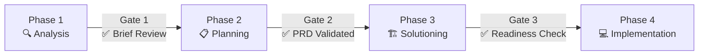
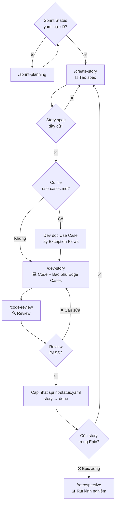
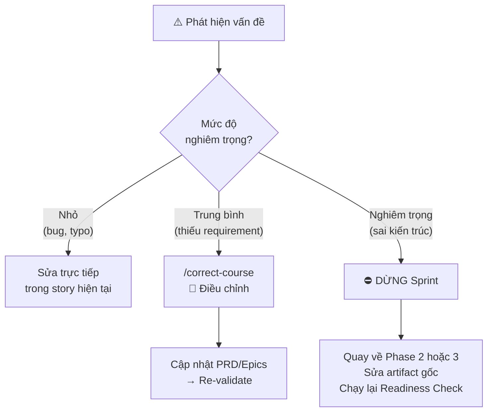
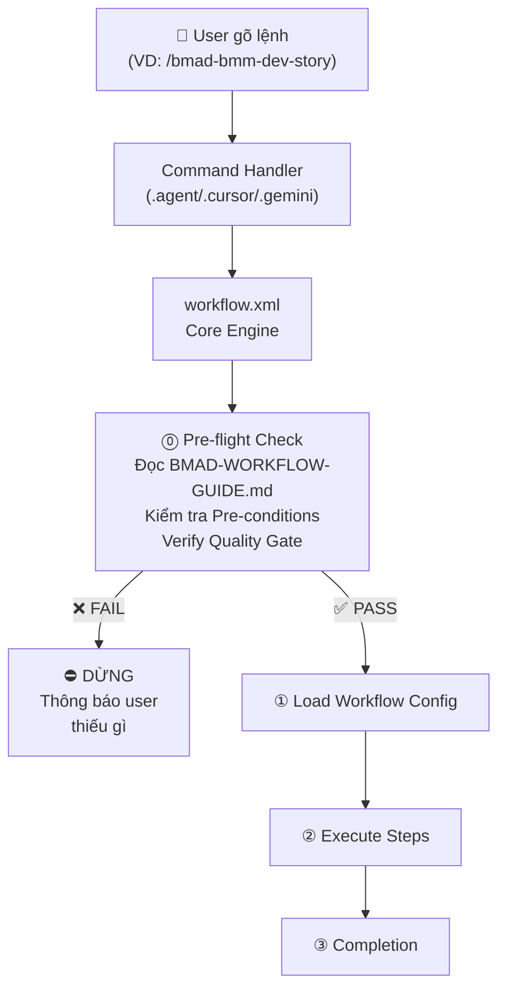

# Quy Trình Phát Triển Phần Mềm Với BMAD Workflow

> **BMAD (Break Method Across Disciplines)** là hệ thống quản lý quy trình phát triển phần mềm tích hợp sẵn các Agent AI chuyên biệt. Mỗi Agent đóng vai trò một thành viên trong team và được kích hoạt thông qua các **slash command** (`/lệnh`) ngay trong khung chat.

> [!CAUTION]
> **Tài liệu này là QUY TRÌNH BẮT BUỘC.** Mọi Agent và Workflow PHẢI tuân thủ các điều kiện tiên quyết (Pre-conditions), cổng chất lượng (Quality Gates) và quy tắc kiểm tra trước khi thực thi. Vi phạm quy trình có thể dẫn đến output không đạt chuẩn và phải làm lại.

---

## Tổng Quan Quy Trình

BMAD chia quy trình phát triển thành **4 Phase tuần tự** với **Quality Gate** giữa mỗi phase:



### Nguyên Tắc Chung

1. **Không được bỏ qua bước `required`** — Agent phải từ chối thực thi nếu thiếu artifact tiên quyết.
2. **Mỗi workflow chạy trong context chat MỚI** — tránh nhiễu từ context cũ.
3. **Validation workflow PHẢI dùng LLM khác** — đảm bảo góc nhìn độc lập (tạo bằng GPT → validate bằng Claude, hoặc ngược lại).
4. **Agent PHẢI đọc artifact đầu vào trước khi hỏi user** — không hỏi lại thông tin đã có trong tài liệu.
5. **Khi phát hiện lỗi nghiêm trọng → DỪNG và ROLLBACK** — không tiếp tục cho đến khi artifact nguồn được sửa.

---

## Phase 1 — 🔍 Phân Tích (Analysis)

**Mục tiêu:** Thu thập ý tưởng, nghiên cứu thị trường, định hình sản phẩm.

### Điều kiện tiên quyết (Pre-conditions)
- ✅ User đã cài đặt BMAD (`_bmad/` folder tồn tại)
- ✅ Thư mục output đã được cấu hình (`_bmad-output/`)

### Workflow

| Thứ tự | Lệnh | Agent | Bắt buộc? | Mô tả |
|--------|-------|-------|-----------|-------|
| 1 | `/brainstorming` | 📊 Mary (Analyst) | ❌ | Brainstorm ý tưởng với nhiều kỹ thuật sáng tạo |
| 2 | `/bmad-bmm-market-research` | 📊 Mary (Analyst) | ❌ | Nghiên cứu thị trường, đối thủ, khách hàng |
| 3 | `/bmad-bmm-domain-research` | 📊 Mary (Analyst) | ❌ | Nghiên cứu chuyên sâu về lĩnh vực/ngành |
| 4 | `/bmad-bmm-technical-research` | 📊 Mary (Analyst) | ❌ | Nghiên cứu tính khả thi kỹ thuật |
| 5 | `/bmad-bmm-create-product-brief` | 📊 Mary (Analyst) | ❌ | Tạo Product Brief — tóm tắt ý tưởng sản phẩm |

### 🚪 Quality Gate 1 → Sang Phase 2
| Tiêu chí | Kiểm tra |
|----------|----------|
| Product Brief tồn tại | File `product-brief-*.md` trong `planning-artifacts/` |
| Hoặc User xác nhận bỏ qua | User rõ ràng đã có yêu cầu sản phẩm, không cần Brief |

> [!TIP]
> Phase 1 **tùy chọn** — nhưng nên tạo ít nhất **Product Brief** hoặc **Research Report** để Phase 2 có dữ liệu đầu vào chất lượng.

---

## Phase 2 — 📋 Lập Kế Hoạch (Planning)

**Mục tiêu:** Xây dựng tài liệu PRD và thiết kế UX.

### Điều kiện tiên quyết (Pre-conditions)
- ✅ Đã qua Gate 1 (có Product Brief HOẶC user xác nhận bỏ qua)
- ✅ Nếu có Research Reports → Agent PM phải đọc trước khi bắt đầu

### Workflow

| Thứ tự | Lệnh | Agent | Bắt buộc? | Mô tả |
|--------|-------|-------|-----------|-------|
| 1 | `/bmad-bmm-create-prd` | 📋 John (PM) | ✅ **BẮT BUỘC** | Tạo PRD gồm 11 bước, từ Executive Summary đến NFR |
| 2 | `/bmad-bmm-validate-prd` | 📋 John (PM) | ⚠️ **KHUYẾN CÁO** | Kiểm tra PRD — PHẢI dùng LLM khác |
| 3 | `/bmad-bmm-edit-prd` | 📋 John (PM) | ❌ | Chỉnh sửa PRD dựa trên feedback validate |
| 4 | `/bmad-bmm-create-ux-design` | 🎨 Sally (UX Designer) | ⚠️ **KHUYẾN CÁO** | Thiết kế UX — bắt buộc nếu sản phẩm có giao diện |

### Quy tắc kiểm tra trước khi chạy

> [!IMPORTANT]
> **Agent PM (`/bmad-bmm-create-prd`) PHẢI thực hiện:**
> 1. Liệt kê tất cả `inputDocuments` đã tìm thấy trong `planning-artifacts/` và `docs/`
> 2. Xác nhận với user danh sách tài liệu đầu vào trước khi bắt đầu bước 1
> 3. Nếu PRD đã tồn tại → hỏi user: "Tạo mới hay chỉnh sửa PRD hiện có?"

### Quy tắc validate PRD

> [!WARNING]
> **Validate PRD (`/bmad-bmm-validate-prd`) BẮT BUỘC kiểm tra:**
> - [ ] PRD có frontmatter YAML hoàn chỉnh (stepsCompleted, classification)?
> - [ ] Có Executive Summary rõ ràng?
> - [ ] Functional Requirements đánh số liên tục (FR1, FR2...)?
> - [ ] Non-Functional Requirements có metrics đo lường được?
> - [ ] User Journeys phản ánh đúng personas mục tiêu?
> - [ ] Không có mâu thuẫn giữa Success Criteria và Scope?

### 🚪 Quality Gate 2 → Sang Phase 3
| Tiêu chí | Kiểm tra | Bắt buộc |
|----------|----------|----------|
| PRD tồn tại | File `prd.md` trong `planning-artifacts/` | ✅ |
| PRD đã validate | Không có lỗi `CRITICAL` trong validation report | ⚠️ Khuyến cáo |
| UX Design (nếu có UI) | File `ux-design-*.md` tồn tại | ⚠️ Khuyến cáo |

---

## Phase 3 — 🏗️ Thiết Kế Giải Pháp (Solutioning)

**Mục tiêu:** Thiết kế kiến trúc kỹ thuật, phân tách thành Epics & Stories.

### Điều kiện tiên quyết (Pre-conditions)
- ✅ Đã qua Gate 2 (`prd.md` tồn tại)
- ✅ Agent Architect PHẢI đọc PRD + UX Design (nếu có) trước khi bắt đầu

### Workflow

| Thứ tự | Lệnh | Agent | Bắt buộc? | Mô tả |
|--------|-------|-------|-----------|-------|
| 1 | `/bmad-bmm-create-architecture` | 🏗️ Winston (Architect) | ✅ **BẮT BUỘC** | Thiết kế kiến trúc kỹ thuật |
| 2 | `/bmad-bmm-create-epics-and-stories` | 📋 John (PM) | ✅ **BẮT BUỘC** | Tạo danh sách Epics và Stories |
| 3 | Tương tác tự do | 📊 Mary (Analyst) | ⚠️ **KHUYẾN CÁO** | Phân tích và tạo file `use-cases.md` ánh xạ với các Story phức tạp |
| 4 | `/bmad-bmm-check-implementation-readiness` | 🏗️ Winston (Architect) | ✅ **BẮT BUỘC** | Kiểm tra chéo toàn bộ tài liệu |

### Quy tắc kiểm tra trước khi chạy

> [!IMPORTANT]
> **Tạo Use Cases (Analyst):**
> 1. Gọi trực tiếp `/analyst` **sau khi đã có Epics & Stories**.
> 2. Yêu cầu Analyst phân tích các story phức tạp và tạo file `use-cases.md` chứa luồng chính (Main Flow) và luồng ngoại lệ (Exception Flow).
> 3. Đánh index UC khớp với Story (VD: Story 1.1 → UC-1.1).
> 4. Bắt buộc đối với các tính năng đòi hỏi xử lý edge cases khắt khe (VD: thanh toán, luồng y tế ISO 13485) để đảm bảo Dev không bỏ sót.

> [!IMPORTANT]
> **Agent Architect (`/bmad-bmm-create-architecture`) PHẢI:**
> 1. Đọc toàn bộ PRD trước khi hỏi bất kỳ câu nào
> 2. Kiểm tra `classification.projectType` trong PRD để chọn architectural pattern phù hợp
> 3. Đảm bảo mọi FR trong PRD đều được ánh xạ vào ít nhất 1 component

> [!IMPORTANT]
> **Agent PM (`/bmad-bmm-create-epics-and-stories`) PHẢI:**
> 1. Đọc Architecture document VÀ PRD
> 2. Đảm bảo mỗi Epic có acceptance criteria đo lường được
> 3. Mỗi Story phải nhỏ đủ để hoàn thành trong 1 sprint (ước lượng)

### Quy tắc Implementation Readiness Check

> [!CAUTION]
> **`/bmad-bmm-check-implementation-readiness` là CỔNG CUỐI trước khi code.** Agent PHẢI kiểm tra:
> - [ ] PRD ↔ Architecture: Mọi FR được ánh xạ vào component?
> - [ ] Architecture ↔ Epics: Mọi component có trong ít nhất 1 Epic?
> - [ ] UX ↔ Stories: Mọi màn hình UX được cover bởi stories?
> - [ ] Use Cases ↔ Stories: Các luồng ngoại lệ đã được ánh xạ?
> - [ ] Không có mâu thuẫn giữa NFR và giải pháp kiến trúc?
> - [ ] Dependencies giữa các Epics đã xác định rõ?
> - ⛔ **Nếu có lỗi CRITICAL → KHÔNG được chuyển sang Phase 4. Phải quay lại sửa artifact liên quan.**

### 🚪 Quality Gate 3 → Sang Phase 4
| Tiêu chí | Kiểm tra | Bắt buộc |
|----------|----------|----------|
| Architecture tồn tại | File `architecture.md` trong `planning-artifacts/` | ✅ |
| Epics tồn tại | File `epics.md` trong `planning-artifacts/` | ✅ |
| Readiness Report PASS | File `implementation-readiness-report-*.md`, không có lỗi CRITICAL | ✅ |

---

## Phase 4 — 💻 Triển Khai (Implementation)

**Mục tiêu:** Chạy Sprint, code từng Story, review và retrospective.

### Điều kiện tiên quyết (Pre-conditions)
- ✅ Đã qua Gate 3 (Readiness Report không có lỗi CRITICAL)
- ✅ File `sprint-status.yaml` phải được tạo bởi Sprint Planning

### Workflow

| Thứ tự | Lệnh | Agent | Bắt buộc? | Mô tả |
|--------|-------|-------|-----------|-------|
| 1 | `/bmad-bmm-sprint-planning` | 🏃 Bob (SM) | ✅ **BẮT BUỘC** | Lập kế hoạch Sprint, tạo `sprint-status.yaml` |
| 2 | `/bmad-bmm-create-story` | 🏃 Bob (SM) | ✅ **BẮT BUỘC** | Tạo file spec chi tiết cho Story tiếp theo |
| 3 | `/bmad-bmm-dev-story` | 💻 Amelia (Dev) | ✅ **BẮT BUỘC** | Code story theo spec đã tạo |
| 4 | `/bmad-bmm-code-review` | 💻 Amelia (Dev) | ⚠️ **KHUYẾN CÁO** | Review code — nên dùng LLM khác |
| 5 | `/bmad-bmm-sprint-status` | 🏃 Bob (SM) | ❌ | Xem trạng thái Sprint hiện tại |
| 6 | `/bmad-bmm-retrospective` | 🏃 Bob (SM) | ❌ | Rút kinh nghiệm sau mỗi Epic |

### Quy tắc kiểm tra trước mỗi Story

> [!IMPORTANT]
> **Agent SM (`/bmad-bmm-create-story`) PHẢI kiểm tra trước khi tạo spec:**
> 1. `sprint-status.yaml` tồn tại và hợp lệ
> 2. Story trước đó ở trạng thái `done` (hoặc đây là story đầu tiên)
> 3. Đọc `epics.md` để lấy đúng acceptance criteria cho story

> [!IMPORTANT]
> **Agent Dev (`/bmad-bmm-dev-story`) PHẢI kiểm tra trước khi code:**
> 1. File story spec tồn tại trong `implementation-artifacts/`
> 2. Story ở trạng thái `ready-for-dev` trong `sprint-status.yaml`
> 3. Đọc `architecture.md` để tuân thủ kiến trúc đã thiết kế
> 4. Đọc `use-cases.md` (nếu có) để xử lý toàn bộ các Exception Flow & Edge Cases
> 5. Đọc `project-context.md` (nếu có) để hiểu conventions

> [!WARNING]
> **Agent Dev (`/bmad-bmm-code-review`) PHẢI kiểm tra:**
> - [ ] Code tuân thủ kiến trúc trong `architecture.md`?
> - [ ] Tất cả acceptance criteria trong story spec được đáp ứng?
> - [ ] Không có hardcoded values, credentials, hoặc TODO chưa xử lý?
> - [ ] Error handling đầy đủ?
> - [ ] Nếu FAIL → cập nhật trạng thái story về `in-progress` và quay lại `/dev-story`

### Vòng lặp phát triển Story (có kiểm tra)



---

## Quy Trình Rollback & Correct Course

Khi phát hiện vấn đề nghiêm trọng trong quá trình phát triển:



> [!CAUTION]
> **Quy tắc Rollback:**
> 1. Nếu lỗi liên quan đến **kiến trúc** → quay về Phase 3, sửa `architecture.md`, chạy lại `/check-implementation-readiness`
> 2. Nếu lỗi liên quan đến **yêu cầu thiếu** → quay về Phase 2, cập nhật PRD, chạy lại từ Phase 3
> 3. Mọi thay đổi rollback phải được ghi nhận trong `/correct-course`

---

## Công Cụ Hỗ Trợ (Dùng Bất Kỳ Lúc Nào — Không Cần Gate)

### Phát triển nhanh (Quick Flow)

> [!WARNING]
> Chỉ dùng Quick Flow cho **thay đổi nhỏ, đơn giản**. Nếu task phức tạp → chạy đầy đủ quy trình 4 phases.

| Lệnh | Mô tả |
|-------|-------|
| `/bmad-bmm-quick-spec` | Tạo spec nhanh (không cần PRD đầy đủ) |
| `/bmad-bmm-quick-dev` | Code nhanh task đơn giản |

### Tài liệu & Review
| Lệnh | Mô tả |
|-------|-------|
| `/bmad-bmm-document-project` | Phân tích dự án hiện có và tạo tài liệu |
| `/bmad-bmm-generate-project-context` | Tạo file context cho AI agents |
| `/bmad-bmm-correct-course` | Điều chỉnh hướng đi khi có thay đổi lớn |
| `/help` | Xem gợi ý bước tiếp theo cần làm |

### Agent trực tiếp (hội thoại tự do — không yêu cầu Gate)
| Lệnh tải Agent | Agent | Khả năng |
|-----------------|-------|----------|
| `/dev` | 💻 Amelia (Developer) | Code, debug, refactor tự do |
| `/pm` | 📋 John (PM) | Tư vấn sản phẩm, yêu cầu |
| `/architect` | 🏗️ Winston (Architect) | Tư vấn kiến trúc |
| `/qa` | 🧪 Quinn (QA Engineer) | Tạo automated tests |
| `/analyst` | 📊 Mary (Analyst) | Phân tích nghiệp vụ |
| `/ux-designer` | 🎨 Sally (UX Designer) | Tư vấn thiết kế UX |
| `/sm` | 🏃 Bob (Scrum Master) | Quản lý sprint |
| `/tech-writer` | 📚 Paige (Tech Writer) | Viết tài liệu kỹ thuật |

---

## Module TEA — 🧪 Kiểm Thử Nâng Cao

BMAD còn tích hợp module **TEA (Test Engineering & Architecture)** với Agent **Murat** chuyên về test:

| Lệnh | Phase | Mô tả |
|-------|-------|-------|
| `/bmad-tea-teach-me-testing` | Learning | Học testing qua 7 sessions (TEA Academy) |
| `/bmad-tea-testarch-test-design` | Solutioning | Thiết kế test plan dựa trên phân tích rủi ro |
| `/bmad-tea-testarch-framework` | Solutioning | Khởi tạo test framework (Playwright/Cypress) |
| `/bmad-tea-testarch-ci` | Solutioning | Cấu hình CI/CD pipeline |
| `/bmad-tea-testarch-atdd` | Implementation | Viết failing tests (TDD red phase) |
| `/bmad-tea-testarch-automate` | Implementation | Mở rộng test coverage |
| `/bmad-tea-testarch-test-review` | Implementation | Đánh giá chất lượng test (chấm điểm 0-100) |
| `/bmad-tea-testarch-nfr` | Implementation | Đánh giá Non-Functional Requirements |
| `/bmad-tea-testarch-trace` | Implementation | Tạo ma trận truy xuất và quality gate |

---

## Module CIS — 💡 Sáng Tạo & Đổi Mới

Các workflow hỗ trợ tư duy sáng tạo:

| Lệnh | Agent | Mô tả |
|-------|-------|-------|
| `/bmad-cis-innovation-strategy` | ⚡ Victor | Chiến lược đổi mới và phá vỡ |
| `/bmad-cis-problem-solving` | 🔬 Dr. Quinn | Giải quyết vấn đề có phương pháp |
| `/bmad-cis-design-thinking` | 🎨 Maya | Design Thinking lấy người dùng làm trung tâm |
| `/bmad-cis-brainstorming` | 🧠 Carson | Brainstorming chuyên sâu |
| `/bmad-cis-storytelling` | 📖 Sophia | Kể chuyện thuyết phục |

---

## Cấu Trúc Thư Mục Output

Khi chạy các workflow, BMAD tạo ra các artifact trong thư mục `_bmad-output/`:

```
_bmad-output/
├── planning-artifacts/       ← PRD, Architecture, Epics, UX, Research
│   └── research/             ← Các báo cáo nghiên cứu
├── implementation-artifacts/ ← Story specs, Sprint status
├── test-artifacts/           ← Test plans, reports
├── brainstorming/            ← Kết quả brainstorm
└── bmb-creations/            ← Agent/Module/Workflow mới (nếu tự tạo)
```

---

## Quy Tắc Vàng Khi Sử Dụng BMAD

1. **Mỗi workflow nên chạy trong một context chat mới** — giúp Agent tập trung và không bị nhiễu.
2. **Các bước `required` phải hoàn thành tuần tự** — không bỏ qua bước bắt buộc.
3. **Dùng `/help` khi không biết bước tiếp theo** — Agent sẽ phân tích artifacts hiện có và gợi ý.
4. **Validation workflow nên dùng LLM khác** — để có góc nhìn đa chiều (ví dụ: tạo bằng GPT, validate bằng Claude).
5. **Quick Flow cho việc nhỏ** — không cần chạy toàn bộ 4 phases cho task đơn giản, hãy dùng `/quick-spec` + `/quick-dev`.

---

## Cơ Chế Thực Thi Quy Trình (Enforcement)

Để đảm bảo mọi Agent và Workflow **tự động tuân thủ** quy trình này, hệ thống BMAD sử dụng **3 lớp bảo vệ**:

### Lớp 1 — Core Engine (`_bmad/core/tasks/workflow.xml`)

Đây là **bộ máy trung tâm** mà tất cả BMAD workflows đều phải đi qua. Trong `workflow.xml` có **Step 0 "Pre-flight Compliance Check"** chạy **TRƯỚC** mọi workflow:

```xml
<step n="0" title="Pre-flight Compliance Check" critical="true">
  <!-- Agent PHẢI đọc docs/BMAD-WORKFLOW-GUIDE.md -->
  <!-- Agent PHẢI kiểm tra Pre-conditions của Phase hiện tại -->
  <!-- Agent PHẢI verify Quality Gate đã pass -->
  <!-- Nếu KHÔNG đạt → DỪNG và thông báo user -->
</step>
```

**Tác dụng:** Mọi lệnh BMAD (create-prd, dev-story, code-review...) đều phải qua bước kiểm tra này. Agent sẽ tự động đọc tài liệu quy trình và từ chối thực thi nếu thiếu điều kiện.

### Lớp 2 — Project Rules (`CLAUDE.md`)

File `CLAUDE.md` ở thư mục gốc được **tự động đọc** bởi các Claude-based agents (Claude Code, Cursor với Claude) khi mở project. Trong file này có section **"BMAD Process Compliance"** yêu cầu:

- Đọc `docs/BMAD-WORKFLOW-GUIDE.md` trước khi chạy workflow
- Kiểm tra Pre-conditions và artifact đầu vào
- Không bỏ qua bước `required`
- Dừng khi gặp lỗi CRITICAL

### Lớp 3 — Agent Memory (`_bmad/_memory/process-compliance-rules.md`)

File quy tắc tuân thủ nằm trong thư mục `_memory` — đây là vùng kiến thức chung mà các BMAD Agent có thể tham chiếu bất kỳ lúc nào.

### Sơ đồ luồng thực thi



---

## Ví Dụ: Luồng Phát Triển Hoàn Chỉnh

```
1️⃣  /bmad-bmm-create-product-brief    → Định hình ý tưởng
2️⃣  /bmad-bmm-create-prd              → Viết PRD chi tiết
3️⃣  /bmad-bmm-validate-prd            → Kiểm tra PRD
4️⃣  /bmad-bmm-create-ux-design        → Thiết kế UX (nếu có UI)
5️⃣  /bmad-bmm-create-architecture     → Thiết kế kiến trúc
6️⃣  /bmad-bmm-create-epics-and-stories → Phân tách Epics & Stories
7️⃣  /bmad-bmm-check-implementation-readiness → Kiểm tra sẵn sàng
8️⃣  /bmad-bmm-sprint-planning         → Lập kế hoạch Sprint
9️⃣  /bmad-bmm-create-story            → Tạo spec Story #1
🔟  /bmad-bmm-dev-story               → Code Story #1
1️⃣1️⃣ /bmad-bmm-code-review           → Review code
    ↻ Lặp lại bước 9-11 cho các story tiếp theo
1️⃣2️⃣ /bmad-bmm-retrospective         → Rút kinh nghiệm sau Epic
```

---

## Hướng Dẫn Thiết Lập BMAD Cho Dự Án Mới

> [!IMPORTANT]
> Hướng dẫn dưới đây áp dụng cho bất kỳ dự án mới nào muốn sử dụng BMAD workflow. Thực hiện đúng các bước để đảm bảo mọi Agent đều tuân thủ quy trình.

### Bước 1 — Cài đặt BMAD

```bash
# Vào thư mục dự án mới
cd /path/to/new-project

# Cài đặt BMAD thông qua npx (tự động tạo thư mục _bmad/)
npx -y bmad-setup@latest
```

> [!NOTE]
> Sau khi cài đặt, BMAD sẽ tạo ra các thư mục:
> - `_bmad/` — Chứa agents, workflows, config
> - `_bmad-output/` — Thư mục chứa artifact output
> - `.agent/workflows/` — Command definitions cho Antigravity
> - `.cursor/commands/` — Command definitions cho Cursor
> - `.gemini/commands/` — Command definitions cho Gemini

### Bước 2 — Cấu hình dự án

Chỉnh sửa file `_bmad/bmm/config.yaml`:

```yaml
project_name: TenDuAnCuaBan
user_skill_level: intermediate    # beginner | intermediate | advanced
planning_artifacts: "{project-root}/_bmad-output/planning-artifacts"
implementation_artifacts: "{project-root}/_bmad-output/implementation-artifacts"
project_knowledge: "{project-root}/docs"

# Ngôn ngữ giao tiếp
user_name: TenCuaBan
communication_language: Vietnamese
document_output_language: Vietnamese
output_folder: "{project-root}/_bmad-output"
```

### Bước 3 — Copy tài liệu quy trình và Workflows tuỳ chỉnh

Copy các file sau từ dự án mẫu (hoặc giải nén từ file `bmad-custom-pack.zip` nếu có) đè lên thư mục dự án mới:

**1. Tài liệu & Quy định chung:**
```text
docs/BMAD-WORKFLOW-GUIDE.md                    ← File quy trình
_bmad/_memory/process-compliance-rules.md      ← Quy tắc tuân thủ
CLAUDE.md                                      ← Project rules cho Claude
_bmad/core/tasks/workflow.xml                  ← Core engine (đã có Step 0)
```

**2. Modules tuỳ chỉnh (Use Cases & Validation):**
```text
_bmad/bmm/agents/analyst.md                    ← Agent Mary (đã thêm lệnh UC)
_bmad/bmm/workflows/2-planning/create-use-cases/workflow-use-cases.md  ← Workflow tạo Use Case
_bmad/bmm/workflows/3-solutioning/check-implementation-readiness/steps/step-01-document-discovery.md
_bmad/bmm/workflows/3-solutioning/check-implementation-readiness/steps/step-03-epic-coverage-validation.md
_bmad/bmm/workflows/4-implementation/dev-story/workflow.yaml
_bmad/bmm/workflows/4-implementation/dev-story/instructions.xml
```

### Bước 4 — Xác nhận `workflow.xml` đã có Step 0

Kiểm tra file `_bmad/core/tasks/workflow.xml` có chứa Step 0 "Pre-flight Compliance Check":

```xml
<step n="0" title="Pre-flight Compliance Check" critical="true">
  ...
</step>
```

Nếu chưa có (vì dùng bản BMAD cũ), thêm đoạn XML sau **ngay trước** `<step n="1">`:

```xml
<step n="0" title="Pre-flight Compliance Check" critical="true">
  <objective>Verify process compliance before executing any workflow</objective>
  <substep n="0a" title="Load Process Rules">
    <action>Read {project-root}/docs/BMAD-WORKFLOW-GUIDE.md</action>
    <action>Read {project-root}/_bmad/_memory/process-compliance-rules.md</action>
  </substep>
  <substep n="0b" title="Verify Pre-conditions">
    <action>Identify which Phase this workflow belongs to</action>
    <action>Check all Pre-conditions listed for this Phase</action>
    <action>Verify required input artifacts exist</action>
    <check if="pre-conditions NOT met">
      <action>STOP and inform user which pre-conditions are missing</action>
      <action>Suggest the correct workflow to run first</action>
    </check>
  </substep>
  <substep n="0c" title="Verify Quality Gate">
    <action>Check if previous Phase's Quality Gate has been passed</action>
    <check if="Quality Gate NOT passed">
      <action>WARN user</action>
      <ask>Previous Quality Gate not passed. Continue anyway? (y/n)</ask>
    </check>
  </substep>
</step>
```

### Bước 5 — Cập nhật `CLAUDE.md` cho dự án mới

Thêm section sau vào `CLAUDE.md` của dự án:

```markdown
## ⚠️ BMAD Process Compliance (BẮT BUỘC)

**Trước khi thực thi BẤT KỲ BMAD workflow nào**, Agent PHẢI:
1. Đọc file `docs/BMAD-WORKFLOW-GUIDE.md`
2. Kiểm tra Pre-conditions của Phase hiện tại
3. Xác nhận artifact đầu vào đã tồn tại
4. KHÔNG bỏ qua bước `required` hoặc Quality Gate
```

### Bước 6 — Bắt đầu phát triển

Sau khi hoàn tất 5 bước trên, chạy workflow đầu tiên:

```
/bmad-bmm-create-product-brief
```

Hoặc nếu đã có ý tưởng rõ ràng:

```
/bmad-bmm-create-prd
```

### Checklist thiết lập nhanh

- [ ] Cài đặt BMAD (`npx -y bmad-setup@latest`)
- [ ] Cấu hình `_bmad/bmm/config.yaml` (tên dự án, ngôn ngữ)
- [ ] Copy bộ file `bmad-custom-pack` (gồm Quy định, Core Engine, Agent, Workflows)
- [ ] Cập nhật `CLAUDE.md` với section BMAD Compliance
- [ ] Kiểm tra `workflow.xml` có Step 0
- [ ] Chạy `/help` để xác nhận hệ thống hoạt động
- [ ] Bắt đầu Phase 1 hoặc Phase 2

---

*Tài liệu quy trình BMAD — Phiên bản 1.0 — Áp dụng cho mọi dự án sử dụng BMAD v6.0+*

