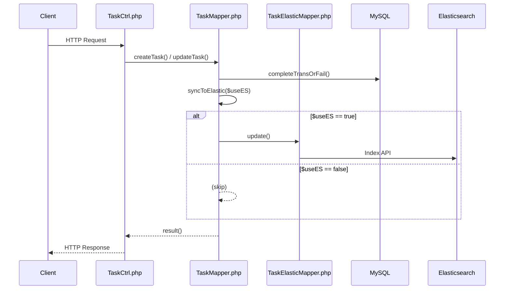

# BÁO CÁO TÌM HIỂU ELASTICSEARCH VÀ ÁP DỤNG THỰC TẾ

*Chủ đề: Tích hợp đồng bộ dữ liệu Module Task trực tiếp sang Elasticsearch*

---

## 1. Tổng quan về Elasticsearch

**Elasticsearch** là một công cụ tìm kiếm và phân tích phân tán, mã nguồn mở, được xây dựng trên nền tảng Apache Lucene. Nó cung cấp khả năng tìm kiếm toàn văn bản (full-text search) theo thời gian thực với hiệu suất rất cao.

*   **Document-oriented:** Dữ liệu lưu dưới dạng JSON documents thay vì các bảng như Relational Database.
*   **Inverted Index:** Sử dụng cấu trúc chỉ mục ngược giúp truy xuất từ khóa cực nhanh.
*   **Distributed & Scalable:** Khả năng mở rộng ngang (horizontal scaling) tốt, tự động phân mảnh (sharding) và nhân bản (replication) dữ liệu.

## 2. Ngữ cảnh bài toán (Ví dụ thực tế)

Trong hệ thống PACS hiện tại, dữ liệu công việc (Task) đang được lưu trữ trên MySQL. Tuy nhiên, khi khối lượng Task tăng lên, việc tìm kiếm và lọc dữ liệu trên MySQL gặp hạn chế về mặt hiệu năng. Yêu cầu đặt ra là:

*   Tạo một cơ chế đồng bộ (sync) thông tin Task từ MySQL sang Elasticsearch.
*   Quá trình đồng bộ diễn ra **trực tiếp (synchronous)** ngay trong luồng xử lý của PHP, đảm bảo dữ liệu trên Elasticsearch luôn khớp tức thời (real-time) với MySQL.
*   Hỗ trợ tìm kiếm nhanh theo trạng thái, người được giao, độ ưu tiên... trên Kibana/Elastic.

## 3. Triển khai chi tiết (Implementation)

### 3.1. Xây dựng Mapper cho Elasticsearch

Tạo class `TaskElasticMapper` kế thừa từ base `ElasticMapper` để quy định index là **task** và cung cấp các hàm lọc (filter) đặc thù.

```php
namespace Company\Task\Model;
use Company\ElasticSearch\ElasticMapper;

class TaskElasticMapper extends ElasticMapper {
    public function __construct() {
        parent::__construct();
        $this->from('task');
    }
    // Cung cấp các hàm: filterSiteFK, filterStatus, filterPriority...
}
```

### 3.2. Viết hàm đồng bộ dữ liệu (Sync Function)

Trong `TaskMapper`, hàm `syncToElastic` được bổ sung để lấy dữ liệu mới nhất (kèm các trường tổng hợp như assignees) và gọi API `update` đẩy thẳng lên Elasticsearch.

```php
function syncToElastic($siteID, $taskID) {
    // 1. Query lấy bản ghi task và danh sách assignee từ MySQL
    $sql = "SELECT t.*, ... FROM task t WHERE t.id = ? AND t.siteFK = ?";
    $task = $this->db->getRow($sql, [$taskID, $siteID]);

    if ($task) {
        // 2. Format dữ liệu
        if (!empty($task['assigneeIDs'])) $task['assigneeIDs'] = explode(',', $task['assigneeIDs']);
        if (!empty($task['attrs'])) {
            $task['attrs'] = json_decode($task['attrs'], true);
        }
        
        // 3. Gọi API lưu trực tiếp lên Elasticsearch
        try {
            TaskElasticMapper::makeInstance()->update($taskID, $task);
        } catch (\Exception $e) {
            // Log lỗi nếu ES không khả dụng
        }
    }
}
```

### 3.3. Tích hợp đồng bộ vào luồng nghiệp vụ (Hooking)

Hàm `syncToElastic` được gọi ngay sau khi các thao tác ghi vào database hoàn tất:

*   Tạo Task mới (`createTask`)
*   Cập nhật thông tin cơ bản Task (`updateTask`)
*   Xóa Task (`deleteTask`)
*   Đổi trạng thái Workflow của Task (`TaskWorkflowGuard::executeTransition`)
*   Phân công và Đổi hạn chót (`assignIndividual`, `updateDeadline`)

## 4. Kiểm thử trên Kibana

Vì dữ liệu được đẩy trực tiếp, nên ngay sau khi gọi API cập nhật, bạn có thể kiểm tra ngay lập tức trên Dev Tools của Kibana:

```json
GET task/_search
{
  "query": {
    "match": {
      "status": "Đang thực hiện"
    }
  },
  "sort": [
    {
      "updatedDate": {
        "order": "desc"
      }
    }
  ]
}
```

Kết quả trả về JSON document chứa đầy đủ các thông tin của task.

## 5. Ứng dụng Elasticsearch để xuất Báo cáo Thống kê (Aggregations)

Điểm mạnh thực sự của Elasticsearch không chỉ nằm ở tìm kiếm văn bản mà còn ở khả năng **Aggregations** (gom nhóm, đếm số lượng, thống kê). Để tận dụng điều này, hệ thống đã được bổ sung thêm tính năng Báo cáo.

### 5.1. Viết hàm thống kê trong Mapper
Trong `TaskElasticMapper`, hàm `getTaskReport($siteID)` được thêm vào để sử dụng cấu trúc `aggs` lấy ra số lượng Task theo **Trạng thái (status)** và **Độ ưu tiên (priority)** chỉ với 1 query duy nhất:

```php
public function getTaskReport($siteID) {
    $params = [
        'index' => $this->index,
        'body' => [
            'size' => 0, // Chỉ lấy số liệu thống kê, không lấy documents
            'query' => [
                'bool' => [
                    'must' => [
                        ['term' => ['siteFK.keyword' => $siteID]],
                        ['term' => ['deleted' => 0]]
                    ]
                ]
            ],
            'aggs' => [
                'tasks_by_status' => [
                    'terms' => ['field' => 'status.keyword', 'size' => 10]
                ],
                'tasks_by_priority' => [
                    'terms' => ['field' => 'priority.keyword', 'size' => 10]
                ]
            ]
        ]
    ];
    return $this->conn->search($params)['aggregations'] ?? [];
}
```

### 5.2. Mở Endpoint cho Client
Ở phía Controller (`TaskCtrl.php`), một endpoint `GET /:siteID/rest/task/report` được cung cấp để giao diện gọi và vẽ biểu đồ ngay lập tức với tốc độ phản hồi tính bằng mili-giây.

## 6. Phân tích Ưu - Nhược điểm của giải pháp (Synchronous Update)

Cách làm hiện tại là **Đồng bộ trực tiếp (Synchronous)** từ code PHP lên Elasticsearch (không qua Kafka/Message Queue). Dưới đây là các đánh giá về hướng đi này:

### Ưu điểm:
*   **Dữ liệu Real-time:** Độ trễ bằng 0. Người dùng thao tác (sửa/xóa task) xong là dữ liệu trên Elasticsearch khớp hoàn toàn với MySQL ngay lập tức. Tính năng tìm kiếm trên UI sẽ luôn trả về kết quả chuẩn xác nhất.
*   **Đơn giản, dễ triển khai:** Không cần thiết lập thêm các thành phần hạ tầng phức tạp (Kafka, Zookeeper, Supervisor Workers). Mã nguồn dễ đọc, dễ bảo trì và dễ debug.
*   **Dễ kiểm soát lỗi:** Việc lỗi khi index lên Elasticsearch có thể được bắt (try/catch) và ghi log ngay trong một luồng (thread) xử lý yêu cầu của client.

### Nhược điểm:
*   **Tăng độ trễ phản hồi (Latency):** Client phải đợi hệ thống lưu xuống MySQL, sau đó đợi thêm bước gọi HTTP REST API sang Elasticsearch hoàn tất thì mới nhận được phản hồi. Nếu ES xử lý chậm, người dùng sẽ có cảm giác ứng dụng bị lag.
*   **Chịu tải kém (Low Throughput):** Khi có lượng traffic đột biến (hàng ngàn người cùng tạo/sửa Task), Elasticsearch có thể trở thành nút thắt cổ chai (bottleneck) và bị quá tải do không có cơ chế xếp hàng (Queue/Buffer).
*   **Khả năng mất đồng bộ (Data Inconsistency):** Nếu Elasticsearch bị down hoặc mạng chập chờn, dữ liệu lưu ở MySQL thành công nhưng gọi API sang ES thất bại, dẫn đến tình trạng sai lệch dữ liệu giữa DB và ES nếu không có cơ chế lưu vết (retry) hợp lý.

## 7. Kết luận

Việc sử dụng trực tiếp API Elasticsearch trong logic code giải quyết tốt bài toán tìm kiếm và đáp ứng tính real-time tuyệt đối. Đây là cách tiếp cận phù hợp cho các module có tần suất thay đổi dữ liệu vừa phải (như Task). Trong tương lai, nếu hệ thống có traffic cực kỳ lớn, ta có thể dễ dàng nâng cấp sang kiến trúc Event-Driven (sử dụng Message Queue) dựa trên bộ khung này.

## 8. Sơ đồ luồng xử lý (Sequence Diagram)

Sơ đồ dưới đây mô tả quá trình từ khi người dùng thao tác trên giao diện cho đến khi dữ liệu được đồng bộ thành công lên Elasticsearch.



**Giải thích luồng chạy:**
1. Client gửi HTTP Request gọi vào Controller (`TaskCtrl.php`).
2. Controller gọi hàm nghiệp vụ của Mapper (ví dụ `createTask`, `updateTask`) để lưu dữ liệu vào MySQL.
3. Sau khi lưu MySQL thành công, hệ thống gọi hàm `syncToElastic($useES)` để bắt đầu đồng bộ.
4. **Kiểm tra cờ `$useES`:**
   - Nếu là **`true`**: Dữ liệu sẽ được đẩy trực tiếp sang Elasticsearch thông qua `TaskElasticMapper`.
   - Nếu là **`false`**: Bỏ qua quá trình đồng bộ (skip).
5. Cuối cùng, API hoàn tất và trả về kết quả (HTTP Response) cho Client.
